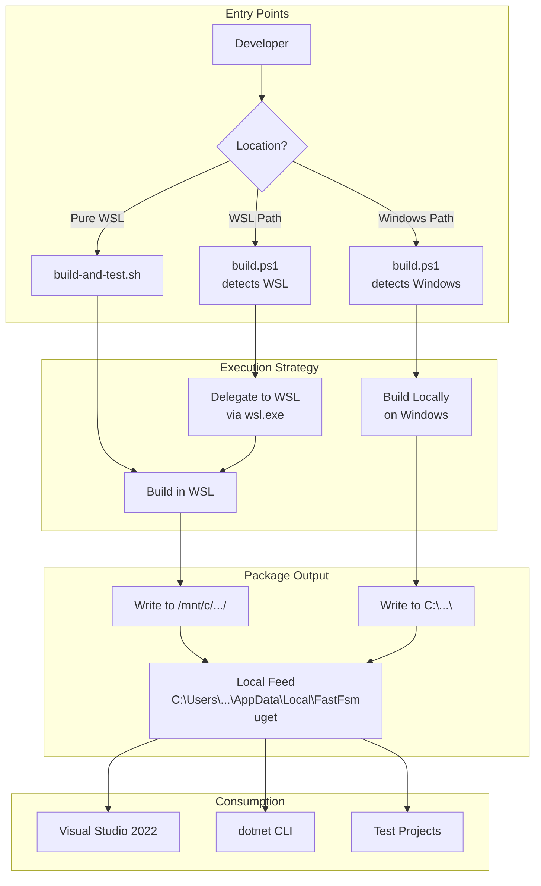
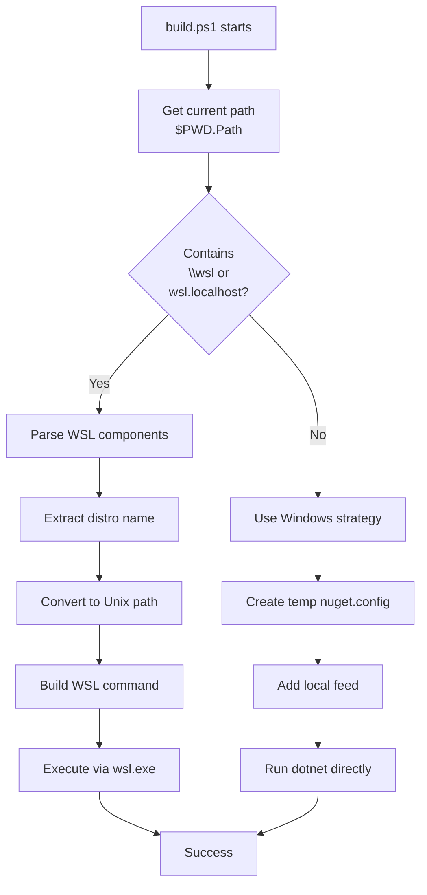
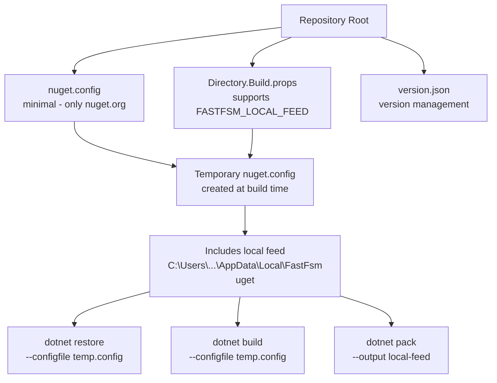
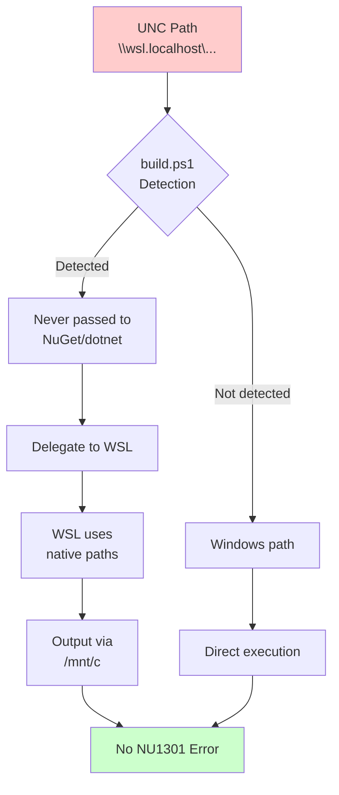
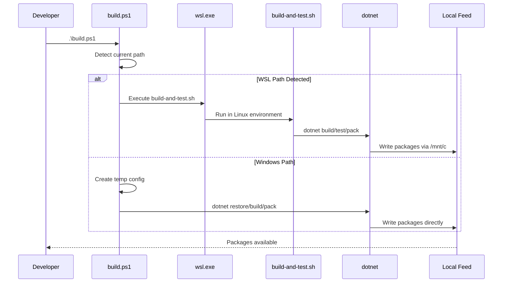
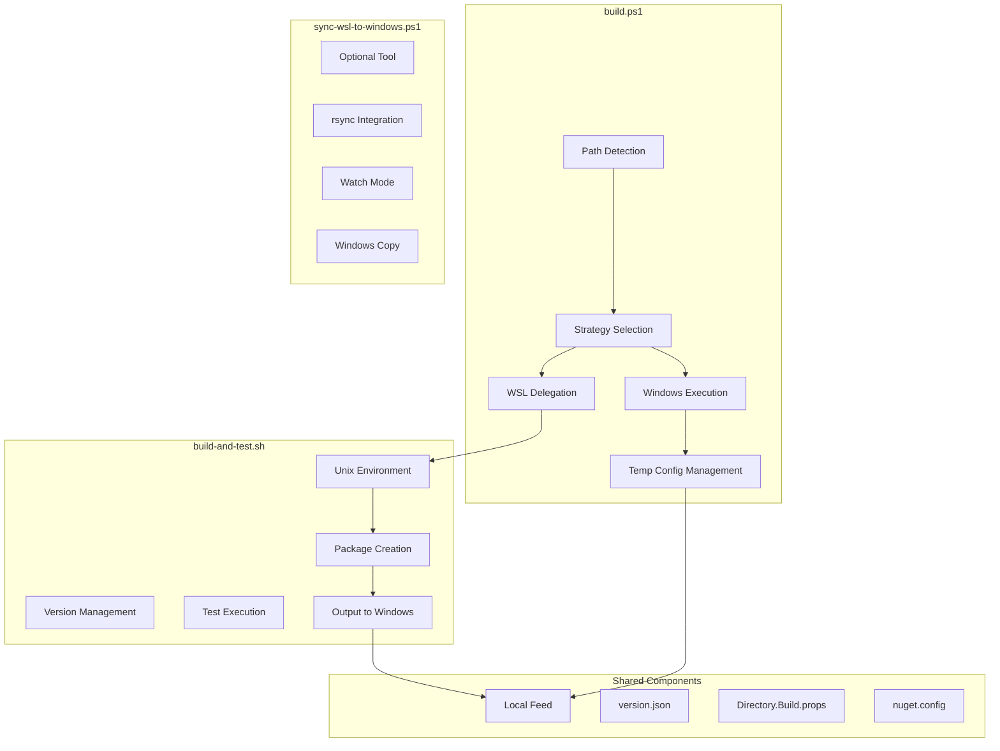
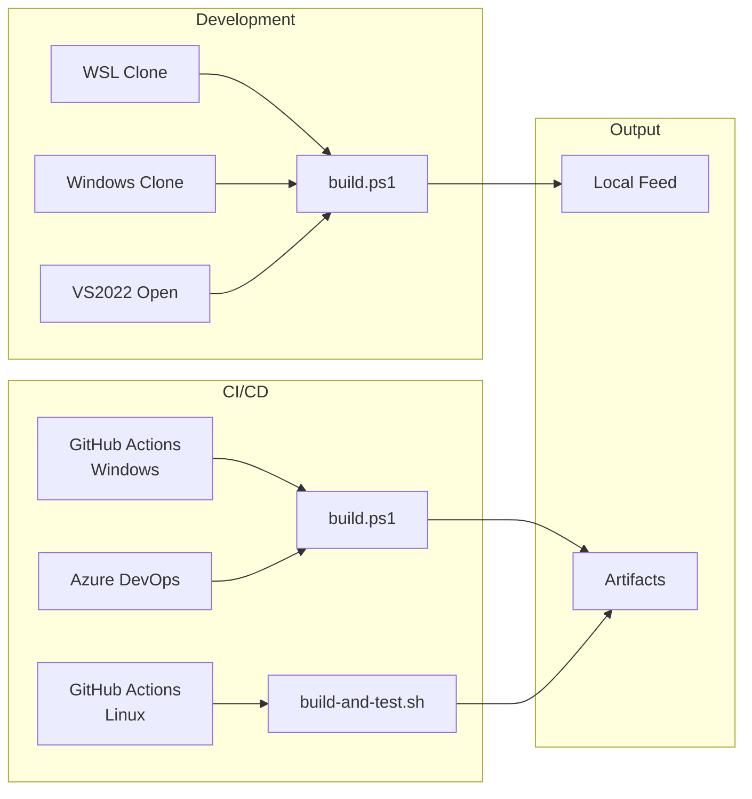
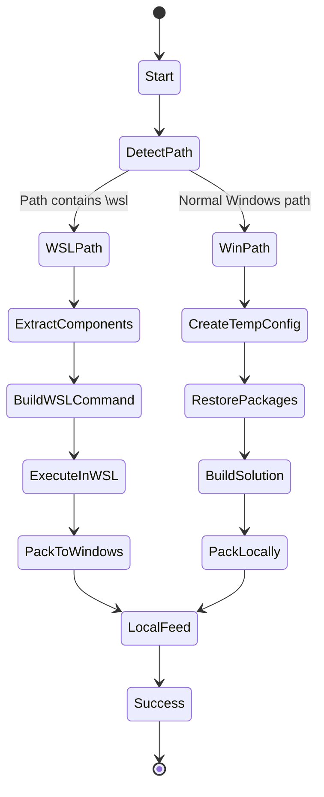
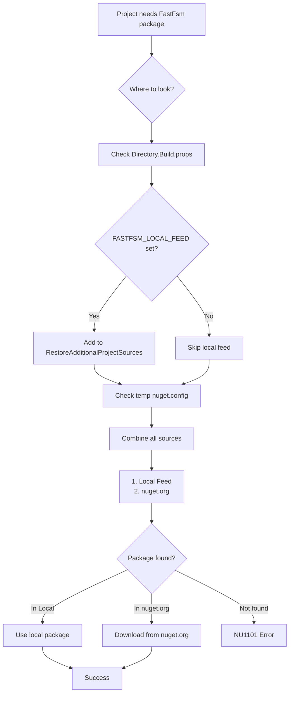

# FastFSM Portable Build System - Architecture Diagrams

## System Overview



## Path Detection Flow



## Data Flow Architecture

```mermaid
graph LR
    subgraph "WSL Environment"
        A1[Source Code<br/>/home/user/FastFsm]
        A2[build-and-test.sh]
        A3[dotnet pack]
        A1 --> A2
        A2 --> A3
    end
    
    subgraph "Bridge"
        A3 --> B1[/mnt/c mount]
        B1 --> B2[File System<br/>Translation]
    end
    
    subgraph "Windows Environment"
        B2 --> C1[Local Feed<br/>C:\Users\...\AppData\Local\FastFsm\nuget]
        C1 --> C2[Visual Studio 2022]
        C1 --> C3[Windows dotnet CLI]
        C1 --> C4[Package Manager]
    end
```

## Configuration Hierarchy



## Error Prevention Strategy



## Script Interaction Model



## Component Responsibilities



## Deployment Scenarios



## File System Mapping

```
WSL View                          Windows View
────────                          ────────────
/home/user/FastFsm/              \\wsl.localhost\Ubuntu\home\user\FastFsm\
    ├── build-and-test.sh            ├── build-and-test.sh
    ├── build.ps1                    ├── build.ps1
    └── src/                         └── src/
        
/mnt/c/Users/user/               C:\Users\user\
    └── AppData/Local/               └── AppData\Local\
        └── FastFsm/                     └── FastFsm\
            └── nuget/                       └── nuget\
                ├── pkg1.nupkg                   ├── pkg1.nupkg
                └── pkg2.nupkg                   └── pkg2.nupkg

Key: WSL writes to /mnt/c → Windows sees in C:\
     No UNC paths involved in the process
```

## State Machine: Build Process



## Package Resolution Flow



## Summary

These diagrams illustrate the complete architecture of the FastFSM portable build system, showing:

1. **Entry point detection** and strategy selection
2. **Path translation** avoiding UNC issues
3. **Data flow** from source to packages
4. **Configuration hierarchy** and temporary configs
5. **Error prevention** through architectural design
6. **Component interactions** via sequence diagrams
7. **Deployment flexibility** across environments
8. **File system mapping** between WSL and Windows
9. **State transitions** during build process
10. **Package resolution** logic

The key architectural insight is that by detecting the execution context and choosing the appropriate strategy, we completely avoid exposing UNC paths to NuGet/dotnet tools, eliminating the NU1301 errors while maintaining full portability.