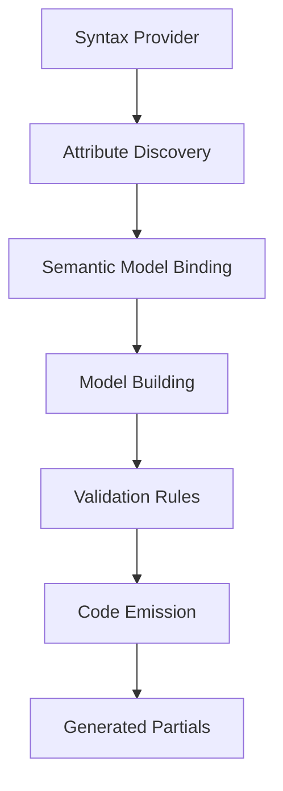

# FastFsm Repository Structure Analysis

**Generated**: 2025-08-06T10:43:27+00:00  
**Commit**: 067262b  
**.NET SDKs**: 8.0.411, 9.0.303  
**Platform**: Linux WSL2 (x86_64)

## Table of Contents
1. [Repository Overview](#1-repository-overview)
2. [Solution & Projects](#2-solution--projects)
3. [Public API Surface](#3-public-api-surface)
4. [Source Generator Architecture](#4-source-generator-architecture)
5. [Runtime Semantics](#5-runtime-semantics)
6. [Diagnostics Catalog](#6-diagnostics-catalog)
7. [Build & Test Infrastructure](#7-build--test-infrastructure)
8. [Performance & AOT](#8-performance--aot)
9. [Extension Points](#9-extension-points)
10. [HSM Integration Surface](#10-hsm-integration-surface)
11. [Risks & Open Questions](#11-risks--open-questions)

---

## 1. Repository Overview

### Size & Structure
- **Total Files**: 328 (312 .cs, 15 .csproj, 1 .sln)
- **Main Solution**: FastFsm.Net.sln (19 projects)
- **Directory Structure**: Generator-centric with clear separation of concerns

### Project Categories
| Category | Count | Purpose |
|----------|-------|---------|
| Generators | 5 | Source generation infrastructure |
| Runtime | 3 | Core FSM implementation & contracts |
| Tests | 6 | Unit & integration testing |
| Benchmarks | 1 | Performance validation |
| Utilities | 2 | Helper libraries |
| Experiments | 2 | Prototype projects (marked for deletion) |

### Key Directories
```
FastFsm/
├── Abstractions/           # Attribute definitions
├── Generator/              # Main source generator
├── Generator.Model/        # FSM model types
├── Generator.Rules/        # Validation rules
├── StateMachine/           # Runtime library
├── StateMachine.Logging/   # Logging extension
└── StateMachine.DependencyInjection/  # DI extension
```

---

## 2. Solution & Projects

### Core Projects

| Project | Type | TFM | Key Dependencies |
|---------|------|-----|------------------|
| **StateMachine** | Runtime | net9.0 | Generator (analyzer) |
| **Generator** | Source Gen | netstandard2.0 | Model, Rules, Abstractions |
| **Abstractions** | Library | netstandard2.0 | None |
| **Generator.Model** | Library | netstandard2.0 | None |
| **Generator.Rules** | Library | netstandard2.0 | None |

### Extension Projects

| Project | Type | Purpose |
|---------|------|---------|
| **StateMachine.Logging** | NuGet | ILogger integration |
| **StateMachine.DependencyInjection** | NuGet | DI container support |
| **Generator.Log** | Source Gen | Logging code generation |
| **Generator.DependencyInjection** | Source Gen | Factory pattern generation |

### Build Configuration
- **AOT Ready**: `IsAotCompatible=true`, `EnableTrimAnalyzer=true`
- **Packaging**: Dev versions with timestamp (`*-dev.yyyyMMddHHmmss`)
- **Local Feed**: `./nupkgs` for development workflow

---

## 3. Public API Surface

### Core Attributes
```csharp
[StateMachine(typeof(TState), typeof(TTrigger))]
[State("StateName")]
[Transition(FromState, ToState, Trigger)]
[InternalTransition(State, Trigger)]
[PayloadType(typeof(TPayload))]
[OnException("HandlerMethod")]
[GenerateLogging]
[GenerationMode(GenerationVariant)]
```

### Core Interfaces

| Interface | Purpose | Key Methods |
|-----------|---------|-------------|
| `IStateMachine<TState, TTrigger>` | Base contract | `CurrentState`, `Fire`, `TryFire`, `CanFire`, `GetPermittedTriggers` |
| `IAsyncStateMachine<TState, TTrigger>` | Async variant | `FireAsync`, `TryFireAsync`, `CanFireAsync` + CT overloads |
| `IStateMachineWithPayload<TState, TTrigger, TPayload>` | Payload support | `Fire(trigger, payload)` variants |
| `IExtensibleStateMachine` | Extension support | `AddExtension`, `RemoveExtension` |

### Callback Signatures
- **Guards**: `bool Guard()`, `bool Guard(TPayload)`, async variants with CT
- **Actions**: `void Action()`, `void Action(TPayload)`, async variants
- **OnEntry/OnExit**: `void OnEntry()`, `void OnExit()`, async variants

---

## 4. Source Generator Architecture

### Pipeline Type
- **Implementation**: `IIncrementalGenerator` (Generator/Generator.cs:23)
- **Entry Point**: `Initialize(IncrementalGeneratorInitializationContext)` (Generator.cs:35)

### Generation Pipeline



### Key Components

| Component | Location | Responsibility |
|-----------|----------|---------------|
| **StateMachineParser** | Generator/Parsers/StateMachineParser.cs | Parse attributes, build model |
| **CallbackSignatureAnalyzer** | Generator/Helpers/CallbackSignatureAnalyzer.cs | Analyze method signatures |
| **StateMachineCodeGenerator** | Generator/SourceGenerators/StateMachineCodeGenerator.cs | Base code emission |
| **Variant Generators** | Generator/SourceGenerators/*VariantGenerator.cs | Specialized generation |

### Model Structure
- **StateMachineModel**: Root model with states, transitions, config
- **StateModel**: Name, OnEntry/OnExit methods, payload info
- **TransitionModel**: From/To states, trigger, guard/action, payload type
- **ExceptionHandlerModel**: Exception handling configuration

### Execution Order
Enforced in `CoreVariantGenerator.cs:420-475`:
1. **Guard evaluation** → returns false on exception (except OCE)
2. **OnExit callback** → exception aborts transition
3. **State change** → atomic update
4. **OnEntry callback** → exception propagates (handler invoked)
5. **Action execution** → exception propagates (handler invoked)

---

## 5. Runtime Semantics

### Exception Policy

| Stage | Exception Behavior | State Rollback | Handler Invoked |
|-------|-------------------|----------------|-----------------|
| **Guard** | Treated as `false` | N/A | No |
| **OnExit** | Aborts transition | Yes | No |
| **OnEntry** | Propagates | No | Yes |
| **Action** | Propagates | No | Yes |

**OperationCanceledException**: Always propagates, never swallowed

### ExceptionContext Structure
```csharp
ExceptionContext<TState, TTrigger> {
    TState From, To;
    TTrigger Trigger;
    Exception Exception;
    TransitionStage Stage;
    bool StateAlreadyChanged;  // true for OnEntry/Action
}
```

### Exception Directives
- **Propagate** (0): Re-throw exception
- **Continue** (1): Swallow and continue

### CancellationToken Propagation
- Supported in all async callbacks
- Optional parameter in synchronous callbacks
- Proper ConfigureAwait(false) for library code

---

## 6. Diagnostics Catalog

| Code | Severity | Message | Trigger |
|------|----------|---------|---------|
| **FSM001** | Warning | Duplicate transition | Same from/trigger combo |
| **FSM002** | Warning | Unreachable state | No incoming transitions |
| **FSM003** | Error | Invalid method signature | Wrong callback signature |
| **FSM004** | Warning | Missing [StateMachine] | Has transitions but no attribute |
| **FSM005** | Error | Invalid types in attribute | Non-enum types used |
| **FSM006** | Error | Invalid enum value | Undefined enum member |
| **FSM007** | Error | Missing payload type | Payload machine without type |
| **FSM008** | Error | Conflicting payload config | Mixed payload settings |
| **FSM009** | Error | Invalid forced variant | Incompatible variant forced |
| **FSM010** | Error | Guard with payload in non-payload machine | Signature mismatch |
| **FSM011** | Error | Mixed sync/async callbacks | Inconsistent async usage |
| **FSM012** | Error | Invalid guard Task return | Task without bool |
| **FSM013** | Error | Async callback in sync machine | Async where sync required |
| **FSM014** | Error | Invalid async void | async void not allowed |

---

## 7. Build & Test Infrastructure

### Build System
- **Package Strategy**: NuGet packages with dev versions
- **Local Feed**: `./nupkgs` for development
- **Version Pattern**: `1.0.0-dev.yyyyMMddHHmmss`

### Build Order
1. Core projects (Abstractions, Model, Rules)
2. Generator project
3. StateMachine runtime (includes generator as analyzer)
4. Extension packages (Logging, DI)
5. Test projects (consume via NuGet)

### Test Coverage
- Unit tests for each variant (Basic, Payload, Extensions, Pure)
- Async state machine tests
- Logging integration tests
- DI integration tests
- Edge case coverage

---

## 8. Performance & AOT

### Performance Optimizations
- **AggressiveInlining**: Applied to hot paths (TransitionEntry.cs:29, StateMachineBase.cs:37)
- **Switch dispatch**: Zero-allocation trigger resolution
- **No dictionaries**: Compile-time generated switches
- **Struct transitions**: Value type for internal representation

### AOT/Trimming Support
- **StateMachine.csproj**: `IsAotCompatible=true`, `EnableTrimAnalyzer=true`
- **No reflection**: All code generated at compile time
- **Trimming safe**: No dynamic type loading
- **Size optimized**: Generated code uses minimal abstractions

### Benchmark Scenarios
Located in `Benchmark/StateMachineBenchmarks.cs`:
- Basic transitions
- Guard evaluation
- Async operations
- Payload handling
- CanFire/GetPermittedTriggers

---

## 9. Extension Points

### Extension Interface
```csharp
public interface IStateMachineExtension {
    void OnBeforeTransition(TransitionContext context);
    void OnAfterTransition(TransitionContext context);
    void OnGuardEvaluation(GuardContext context);
    void OnTransitionFailed(FailureContext context);
}
```

### Extension Integration
- **Runtime**: `ExtensionRunner.cs` manages extension lifecycle
- **Generated**: Hooks injected at key points
- **DI Support**: Extensions registered in container
- **Logging**: Built-in ILogger extension

### Constructor Overloads
Generated machines support:
- Default constructor
- Extension array constructor
- ILogger constructor (when logging enabled)
- DI factory pattern (when DI enabled)

---

## 10. HSM Integration Surface

### Current Status (Milestone 7 Complete)
✅ **Diagnostics Implemented**: FSM100-FSM105 with user-friendly messages  
✅ **Documentation**: Comprehensive HSM guide in `HSM_Documentation.md`  
✅ **Test Coverage**: Full test suite in `/StateMachine.Tests/HierarchicalStateMachine/`  
✅ **Benchmarks**: Performance comparisons in `/Benchmark/HierarchicalStateMachineBenchmarks.cs`

### Attribute Layer Insertion Points
**Location**: `/Abstractions/Attributes/`
- Extend: `StateAttribute.cs` (add `Parent`, `History` properties)
- Extend: `StateMachineAttribute.cs` (add `EnableHierarchy` flag)
- Create: `InitialSubstateAttribute.cs` for marking initial children
- Add: `HistoryMode` enum (None, Shallow, Deep)

### Model Layer Extensions
**Location**: `/Generator.Model/`
- **StateModel.cs**: Add `ParentState`, `ChildStates[]`, `IsComposite`, `History`
- **StateMachineModel.cs**: Add hierarchy maps:
  - `Dictionary<string, string?> ParentOf`
  - `Dictionary<string, List<string>> ChildrenOf`
  - `Dictionary<string, int> Depth`
  - `Dictionary<string, string?> InitialChildOf`
  - `Dictionary<string, HistoryMode> HistoryOf`
  - `bool HierarchyEnabled`

### Validation Rules (Implemented)
**Location**: `/Generator.Rules/Definitions/`
- **FSM100**: Circular hierarchy detection
- **FSM101**: Multiple/divergent parent validation
- **FSM102**: Composite without initial state
- **FSM103**: Multiple initial children detection
- **FSM104**: History on non-composite validation
- **FSM105**: Implicit composite entry warning

Each rule includes:
- Clear error title
- Actionable fix suggestions
- Detailed descriptions

### Resolution Pipeline
**Location**: `/Generator/SourceGenerators/StateMachineCodeGenerator.cs`
- Hierarchical trigger resolution (nearest ancestor wins)
- LCA computation for state transitions
- Exit sequence generation (leaf → LCA-1)
- Entry sequence generation (LCA+1 → target)

### Entry/Exit Sequencing
**Location**: `/Generator/Helpers/CallbackGenerationHelper.cs`
- `EmitHierarchicalExitSequence`: Bottom-up from leaf
- `EmitHierarchicalEntrySequence`: Top-down to target
- LCA optimization to minimize callbacks
- Exception handling per level

### Code Emission
**All variant generators**:
- Precomputed parent/depth lookup tables
- History state tracking arrays
- Internal transition optimization
- Inherited trigger resolution

### Public API Additions
**Location**: `/StateMachine/Contracts/IStateMachine.cs`
```csharp
bool IsIn(TState state);                    // Check active path
IReadOnlyList<TState> GetActivePath();      // Full hierarchy
ValueTask<IReadOnlyList<TState>> GetActivePathAsync(CancellationToken ct = default);
```

### Runtime Base Classes
**Location**: `/StateMachine/Runtime/StateMachineBase.cs`
- Hierarchy state tracking fields
- LastActiveChild[] for history
- Path traversal methods
- Initial/History entry logic

### Test Infrastructure
**Location**: `/StateMachine.Tests/HierarchicalStateMachine/`
- `HsmTestMachines.cs`: Test state machines
- `HsmBasicTests.cs`: Core functionality
- `HsmExceptionTests.cs`: Exception handling
- `HsmAsyncTests.cs`: Async operations
- Full coverage of all HSM features

### Performance Benchmarks
**Location**: `/Benchmark/HierarchicalStateMachineBenchmarks.cs`
- Flat vs HSM comparison
- History mode overhead
- Structural API performance
- Transition resolution cost

---

## 11. Risks & Open Questions

### HSM Implementation Risks
1. **Code size growth**: Precomputed tables vs runtime computation trade-off
2. **Complexity explosion**: Testing all hierarchy combinations
3. **Breaking changes**: Existing generated code compatibility

### Architectural Decisions
1. **LCA computation**: Compile-time vs runtime
2. **History storage**: Per-instance vs static tables
3. **Transition conflicts**: Internal vs external at same level

### Performance Concerns
1. **Dispatch overhead**: Walking parent chain
2. **Memory usage**: History state tracking
3. **Generation time**: Complex hierarchy analysis

### Open Questions
1. How to handle payload type conflicts across hierarchy?
2. Should OnException policy apply to cascaded entry/exit?
3. How to represent compound states in generated API?
4. Async coordination across hierarchy levels?

---

## Appendix

### File Statistics
```
Total CS files: 312
Total CSPROJ: 15
Solution files: 1
Source generators: 5
Test projects: 6
```

### Key Dependencies
- Microsoft.CodeAnalysis.Analyzers 3.11.0
- .NET 9.0 / .NET Standard 2.0
- No external FSM libraries

### Build Summary
- Core build succeeds with warnings (nullable reference types)
- Package generation requires Abstractions.dll in output
- Tests require local NuGet feed configuration

---

**Document Version**: 1.0  
**Analysis Complete**: 2025-08-06