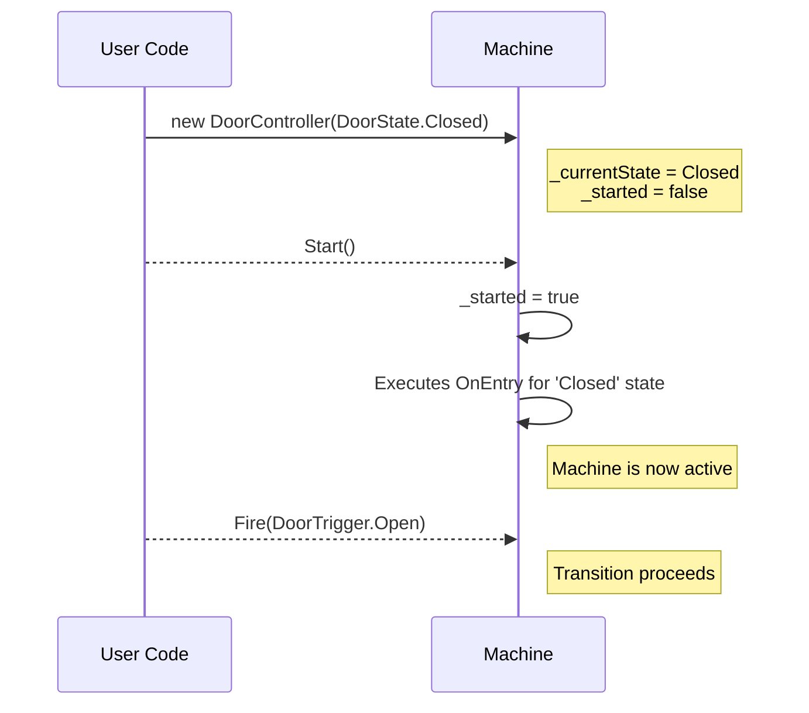

# FastFSM - High-Performance State Machines for .NET

[](https://www.nuget.org/packages/FastFSM.Net/)
[](https://www.google.com/search?q=LICENSE)
[](https://dotnet.microsoft.com/download)

FastFSM is a powerful, zero-overhead finite state machine framework for .NET that leverages C\# source generators to create highly optimized state machines at compile time. It combines the ease of declarative configuration with performance that rivals hand-written code.

## Table of Contents

  - [Why FastFSM?]
  - [Key Features]
  - [Getting Started]
  - [Core Concepts]
  - [The State Machine Lifecycle (New in 0.6)]
  - [Basic Usage]
  - [API Reference]
  - [Advanced Features]
  - [Performance]
  - [Real-World Examples]
  - [Architecture Overview]
  - [Migration Guide]
  - [Contributing]
  - [License]

## Why FastFSM?

Traditional .NET state machine libraries often rely on reflection, dictionaries, or expression trees at runtime, leading to:

  - Performance overhead from indirect calls and allocations
  - Runtime errors that could be caught at compile time
  - Poor compatibility with AOT compilation and trimming
  - Complex APIs that obscure the actual state logic

FastFSM solves these problems by generating optimized code at compile time, giving you:

  - **Zero runtime reflection** - all transitions compile to simple switch statements
  - **Zero heap allocations** - no garbage collection pressure in your state logic
  - **Compile-time validation** - invalid states and transitions are caught during build
  - **Predictable Lifecycle** - explicit start-up logic eliminates race conditions
  - **Native AOT ready** - fully compatible with trimming and ahead-of-time compilation
  - **Intuitive API** - define states with simple attributes, no complex fluent builders

-----

## Key Features

  - 🚀 **Blazing Fast** - transitions execute in \~0.6 nanoseconds
  - 🗑️ **Zero Allocations** - no heap allocations during state transitions
  - 🛡️ **Type Safe** - full IntelliSense support and compile-time checking
  - 📦 **Modular Design** - pay only for features you use
  - 🔌 **Extensible** - optional logging, dependency injection, and custom extensions
  - ⚡ **Async Support** - first-class async/await support with separate sync/async APIs
  - 🎯 **AOT Compatible** - works with Native AOT and aggressive trimming

-----

## Getting Started

### Installation

```bash
# Core package - just the essentials
dotnet add package FastFSM.Net

# Optional: Add structured logging support
dotnet add package FastFSM.Net.Logging

# Optional: Add dependency injection integration
dotnet add package FastFSM.Net.DependencyInjection
```

### Quick Example

```csharp
// 1. Define your states and triggers as enums
public enum DoorState { Open, Closed, Locked }
public enum DoorTrigger { Open, Close, Lock, Unlock }

// 2. Create your state machine class
[StateMachine(typeof(DoorState), typeof(DoorTrigger))]
public partial class DoorController
{
    // 3. Define transitions using attributes
    [Transition(DoorState.Closed, DoorTrigger.Open, DoorState.Open)]
    [Transition(DoorState.Open, DoorTrigger.Close, DoorState.Closed)]
    [Transition(DoorState.Closed, DoorTrigger.Lock, DoorState.Locked)]
    [Transition(DoorState.Locked, DoorTrigger.Unlock, DoorState.Closed)]
    private void ConfigureTransitions() { }
}

// 4. Use your state machine
var door = new DoorController(DoorState.Closed);
door.Start(); // Start the machine to trigger initial OnEntry callbacks

door.CanFire(DoorTrigger.Open);  // true
door.Fire(DoorTrigger.Open);       // door is now Open
door.CurrentState;                 // DoorState.Open
```

-----

## Core Concepts

### States and Triggers

States represent the possible conditions of your system, while triggers are the events that cause transitions between states. Both are defined as enums for type safety and performance.

### Transitions

Transitions define how your state machine moves from one state to another in response to triggers. They can include:

  - **Guards** - conditions that must be true for the transition to occur
  - **Actions** - code that executes during the transition

### State Callbacks

States can have entry and exit callbacks that execute when entering or leaving a state:

  - **OnEntry** - executes when entering a state
  - **OnExit** - executes when leaving a state

-----

## The State Machine Lifecycle (New in 0.6)

As of version 0.6, creating a state machine and running it are two distinct steps. The constructor **only** sets the initial state. You must explicitly start the machine to make it operational and trigger the first `OnEntry` callback. This change prevents race conditions and makes the machine's behavior deterministic.

1.  **Constructor**: Sets the initial `CurrentState` but does **not** run any `OnEntry` logic. The machine is not yet active.
2.  **`Start()` / `StartAsync()`**: Activates the machine. This method runs the `OnEntry` callback for the initial state. Subsequent calls to `Start()` do nothing.
3.  **Operations**: Calling any method like `Fire`, `TryFire`, or `CanFire` before `Start()` will throw an `InvalidOperationException`.

<!-- end list -->



-----

## Basic Usage

### Simple State Machine

```csharp
[StateMachine(typeof(OrderState), typeof(OrderTrigger))]
public partial class OrderWorkflow
{
    [Transition(OrderState.New, OrderTrigger.Submit, OrderState.Submitted)]
    [Transition(OrderState.Submitted, OrderTrigger.Approve, OrderState.Approved)]
    [Transition(OrderState.Submitted, OrderTrigger.Reject, OrderState.Rejected)]
    private void Configure() { }
}

// Usage
var workflow = new OrderWorkflow(OrderState.New);
workflow.Start();
workflow.Fire(OrderTrigger.Submit);
```

### Adding Guards and Actions

```csharp
[StateMachine(typeof(AccountState), typeof(AccountTrigger))]
public partial class BankAccount
{
    private decimal _balance;
    
    [Transition(AccountState.Active, AccountTrigger.Withdraw, AccountState.Active,
        Guard = nameof(HasSufficientFunds),
        Action = nameof(DebitAccount))]
    private void ConfigureWithdrawal() { }
    
    private bool HasSufficientFunds() => _balance >= 100;
    private void DebitAccount() => _balance -= 100;
}

// Usage
var account = new BankAccount(AccountState.Active);
account.Start();
account.Fire(AccountTrigger.Withdraw);
```

### State Entry/Exit Callbacks

```csharp
[StateMachine(typeof(ConnectionState), typeof(ConnectionTrigger))]
public partial class NetworkConnection
{
    [State(ConnectionState.Connected, 
        OnEntry = nameof(StartHeartbeat),
        OnExit = nameof(StopHeartbeat))]
    private void ConfigureStates() { }
    
    [Transition(ConnectionState.Disconnected, ConnectionTrigger.Connect, ConnectionState.Connected)]
    [Transition(ConnectionState.Connected, ConnectionTrigger.Disconnect, ConnectionState.Disconnected)]
    private void ConfigureTransitions() { }
    
    private void StartHeartbeat() => Console.WriteLine("Heartbeat started");
    private void StopHeartbeat() => Console.WriteLine("Heartbeat stopped");
}

// Usage
var connection = new NetworkConnection(ConnectionState.Disconnected);
connection.Start(); // Machine is not active until started
connection.Fire(ConnectionTrigger.Connect); // "Heartbeat started" is printed
```

-----

## API Reference

### StateMachine Attribute

Marks a partial class as a state machine.

```csharp
[StateMachine(typeof(TState), typeof(TTrigger))]
```

**Parameters:**

  - `TState` - Enum type defining possible states
  - `TTrigger` - Enum type defining possible triggers

**Optional Properties:**

  - `DefaultPayloadType` - Default payload type for all transitions
  - `GenerateExtensibleVersion` - Enable extension support

### Transition Attribute

Defines a state transition.

```csharp
[Transition(fromState, trigger, toState, Guard = "method", Action = "method")]
```

**Parameters:**

  - `fromState` - Source state
  - `trigger` - Trigger that causes transition
  - `toState` - Destination state
  - `Guard` (optional) - Method name that returns bool
  - `Action` (optional) - Method name to execute during transition

### State Attribute

Configures state-specific behavior.

```csharp
[State(state, OnEntry = "method", OnExit = "method")]
```

**Parameters:**

  - `state` - The state to configure
  - `OnEntry` (optional) - Method to execute when entering state
  - `OnExit` (optional) - Method to execute when leaving state

### Generated Methods

Every state machine automatically gets these methods. **Note:** All methods (except the constructor) will throw an `InvalidOperationException` if called before `Start()` / `StartAsync()`.

```csharp
// Current state of the machine
TState CurrentState { get; }

// Starts the machine, making it operational and running the initial OnEntry callback.
void Start()
ValueTask StartAsync(CancellationToken ct = default)

// Try to fire a trigger (returns true if successful)
bool TryFire(TTrigger trigger, object? payload = null)
ValueTask<bool> TryFireAsync(TTrigger trigger, object? payload = null, CancellationToken ct = default)

// Fire a trigger (throws if invalid)
void Fire(TTrigger trigger, object? payload = null)
ValueTask FireAsync(TTrigger trigger, object? payload = null, CancellationToken ct = default)

// Check if a trigger can be fired
bool CanFire(TTrigger trigger)

// Get all valid triggers from current state
IReadOnlyList<TTrigger> GetPermittedTriggers()
```

-----

## Advanced Features

### Typed Payloads

```csharp
[StateMachine(typeof(ProcessState), typeof(ProcessTrigger))]
[PayloadType(typeof(ProcessData))]
public partial class DataProcessor
{
    [Transition(ProcessState.Ready, ProcessTrigger.Start, ProcessState.Processing,
        Guard = nameof(IsValidData),
        Action = nameof(ProcessData))]
    private void Configure() { }
    
    private bool IsValidData(ProcessData data) => data != null && data.IsValid;
    private void ProcessData(ProcessData data) => Console.WriteLine($"Processing {data.Id}");
}

// Usage
var processor = new DataProcessor(ProcessState.Ready);
processor.Start(); // Must be started before use
var data = new ProcessData { Id = "123", IsValid = true };
processor.Fire(ProcessTrigger.Start, data);
```

### Async Support

FastFSM provides separate sync and async APIs for clarity and type safety. Async methods return `ValueTask` for high performance.

```csharp
[StateMachine(typeof(DownloadState), typeof(DownloadTrigger))]
public partial class FileDownloader
{
    [Transition(DownloadState.Ready, DownloadTrigger.Start, DownloadState.Downloading,
        Action = nameof(StartDownloadAsync))]
    private void Configure() { }
    
    private async ValueTask StartDownloadAsync()
    {
        await Task.Delay(100); // Simulate async work
    }
}

// Usage
var downloader = new FileDownloader(DownloadState.Ready);
await downloader.StartAsync(); // Use StartAsync for async machines
await downloader.FireAsync(DownloadTrigger.Start);
```

### Dependency Injection

When using `FastFSM.Net.DependencyInjection`, the `IStateMachineFactory` provides helpers to manage the new lifecycle:

```csharp
// In your service configuration (e.g., Program.cs)
services.AddStateMachineFactory();
services.AddTransient<OrderWorkflow>(); // Register your state machine

// In your consumer class
public class OrderService(IStateMachineFactory factory)
{
    public void ProcessNewOrder()
    {
        // Option 1: Create and start manually
        var sm1 = factory.Create<OrderWorkflow>(OrderState.New);
        sm1.Start();
        
        // Option 2: Create and start in one step
        var sm2 = factory.CreateStarted<OrderWorkflow>(OrderState.New);
        
        // Option 3: For async machines
        var downloader = await factory.CreateStartedAsync<FileDownloader>(DownloadState.Ready);
    }
}
```

-----

## Benchmarks

### Performance Summary

FastFSM achieves **sub-nanosecond** transition times (0.81 ± 0.03 ns) for basic synchronous operations, with zero heap allocations.

### Test Environment

**Hardware:** AMD Ryzen 5 9600X (Zen 5, 6C/12T, AVX-512) @ 3.9-5.4 GHz, 32GB DDR5  
**Runtime:** .NET 9.0.5 (RyuJIT AVX-512, Server GC) with `COMPlus_EnableAVX512=1`  
**Benchmark:** BenchmarkDotNet 0.15.2  
**Methodology:** 1024 ops/iteration, 15 iterations (mean ± StdDev), Windows 11 24H2 "High Performance"  
**Date:** 7 Aug 2025

*Note: Results may vary ±5-8% on CPUs without AVX-512 support.*

### FastFSM vs .NET State Machine Libraries

| Scenario | FastFSM | Stateless | LiquidState | Appccelerate | Winner |
|----------|---------|-----------|-------------|--------------|--------|
| **Basic Transitions** | **0.81 ns** | 249.03 ns | 25.31 ns | 260.85 ns | FastFSM (31x vs LiquidState) |
| Guards + Actions | **2.18 ns** | 267.37 ns | n/a¹ | 273.53 ns | FastFSM (123x vs Stateless) |
| Payload | **0.83 ns** | 300.63 ns | 30.13 ns | 291.60 ns | FastFSM (36x vs LiquidState) |
| Can Fire Check | **0.31 ns** | 115.54 ns | n/a¹ | n/a¹ | FastFSM (373x vs Stateless) |
| Get Permitted Triggers | **4.18 ns** | 32.69 ns | n/a¹ | n/a¹ | FastFSM (7.8x vs Stateless) |
| Async Hot Path² | 444.77 ns | 357.12 ns | **75.87 ns** | 504.37 ns | LiquidState (5.9x vs FastFSM) |
| Async With Yield³ | 456.72 ns | 1,100.78 ns | 490.22 ns | 1,738.62 ns | FastFSM (1.1x vs LiquidState) |

¹ API not available in this library  
² Hot path: `ValueTask.CompletedTask` (FastFSM) vs `Task.FromResult` (others) - no scheduler switching  
³ With yield: includes `Task.Yield()` for actual async context switch

### Memory Allocations per Operation

| Scenario | FastFSM | Stateless | LiquidState | Appccelerate |
|----------|---------|-----------|-------------|--------------|
| Basic Transitions | **0 B** | 608 B | 136 B | 1,608 B |
| Guards + Actions | **0 B** | 648 B | n/a | 1,648 B |
| Payload | **0 B** | 912 B | 152 B | 1,736 B |
| Can Fire Check | **0 B** | 232 B | n/a | n/a |
| Get Permitted Triggers | **0 B** | 376 B | n/a | n/a |
| Async Hot Path | **0 B** | 720 B | 216 B | 2,295 B |
| Async With Yield | **0 B** | 1,448 B | 656 B | 3,166 B |

*Note: Values measured in test configuration. Some libraries can achieve zero allocations with different setups.*

**Key Observations:**
- **Synchronous operations**: FastFSM dominates with 31-373x speedup and zero allocations
- **Async hot path**: LiquidState faster due to optimized `Task` pooling vs FastFSM's `ValueTask` overhead
- **Memory efficiency**: Competitors allocate 136-3166 bytes per operation vs FastFSM's consistent zero
- **Code size**: FastFSM 160-8050 bytes⁴ vs competitors' 1106-21417 bytes

⁴ Measured via BenchmarkDotNet DisassemblyDiagnoser (JIT Tier 1, cold stubs excluded)

### FastFSM vs C++ State Machines

**C++ Implementation:** Boost.SML 1.1.9 (header-only template library)  
**Compiler:** MSVC 19.44, Release build with `/O2 /GL /arch:AVX512`  
**Benchmark Framework:** Google Benchmark 1.8.4  
**Code Size Tool:** `dumpbin /summary` (executable section sizes)

| Scenario | FastFSM (.NET) | Boost.SML (C++) | Difference | Notes |
|----------|----------------|-----------------|------------|--------|
| Basic Transitions | **0.81 ns** | 1.23 ns | FastFSM 1.5x faster | JIT-optimized switch vs template dispatch |
| Guards + Actions | 2.18 ns | **1.32 ns** | C++ 1.7x faster | C++ increments register; .NET modifies heap field⁵ |
| Payload | **0.83 ns** | 1.35 ns | FastFSM 1.6x faster | Reference passing overhead in C++ |
| Can Fire Check | **0.31 ns** | 1.28 ns⁶ | FastFSM 4.1x faster | Dedicated API vs state query |
| Async Hot Path⁷ | 444.77 ns | 1.38 ns | C++ 322x faster | Not comparable - see note |

⁵ FastFSM guard modifies object field (memory barrier); C++ increments local counter in CPU register  
⁶ Boost.SML uses `is(state)` check - no dedicated CanFire API  
⁷ C++ 'async' is synchronous simulation (simple increment); CLR uses real async state machine. True C++20 coroutines would add ~50-100ns overhead

### FastFSM vs Rust State Machines

**Rust Implementation:** Hand-optimized state machine (not a library)  
**Compiler:** rustc 1.80.0 with criterion 0.5.1, release build with LTO  
**Flags:** `RUSTFLAGS="-C target-cpu=native"` (enables AVX-512 on Zen 5)  
**Code Size Tool:** `cargo bloat --release`

| Scenario | FastFSM (.NET) | Rust | Difference | Notes |
|----------|----------------|------|------------|--------|
| Basic Transitions | **0.81 ns** | 1.77 ns | FastFSM 2.2x faster | JIT vs LLVM optimization patterns |
| Guards + Actions | 2.18 ns | **0.71 ns** | Rust 3.1x faster | Zero-cost abstractions, no object overhead |
| Payload | 0.83 ns | **0.70 ns** | Rust 1.2x faster | Stack-only operations |
| Async Hot Path⁸ | 444.77 ns | **0.79 ns** | Rust 563x faster | Tokio future vs CLR Task |
| Async With Yield⁹ | 456.72 ns | **11.47 ns** | Rust 40x faster | Runtime scheduler differences |

⁸ No actual async work - measures runtime overhead only  
⁹ `Task.Yield()` (CLR) vs `tokio::task::yield_now()` (Tokio) - different cooperative scheduling models

### Cross-Language Summary

| Scenario | FastFSM (.NET) | Boost.SML (C++) | Rust | Fastest | Notes |
|----------|----------------|-----------------|------|---------|-------|
| Basic Transitions | **0.81 ± 0.03 ns** | 1.23 ns | 1.77 ns | **FastFSM** | Simple switch statement optimal |
| Guards + Actions | 2.18 ns | 1.32 ns | **0.71 ns** | **Rust** | Native register operations win |
| Payload | 0.83 ns | 1.35 ns | **0.70 ns** | **Rust** | Minimal stack manipulation |
| Async (no yield) | 444.77 ns¹⁰ | 1.38 ns¹¹ | **0.79 ns** | **Rust** | CLR async overhead dominates |
| Async (with yield) | 456.72 ns | n/a | **11.47 ns** | **Rust** | Tokio scheduler most efficient |

¹⁰ ValueTask with async state machine overhead  
¹¹ C++ 'async' is synchronous simulation - not real async; true C++20 coroutines would be ~50-100ns

**Key Insights:**
- **FastFSM leads in simple state transitions** - JIT optimization produces ideal machine code for basic switch-case patterns
- **Native languages excel with complex logic** - Rust and C++ avoid virtual dispatch and object field access overhead
- **CLR async carries inherent overhead** - Even empty `ValueTask` operations cost 300-500x more than synchronous code
- **All achieve sub-2ns for synchronous work** - Modern CPU branch prediction makes state machines incredibly efficient

### Memory and Code Size

| Library | Heap Allocations/Op | Native Code Size |
|---------|---------------------|------------------|
| FastFSM | **0 bytes** | 160 - 8,050 bytes |
| Stateless | 608 - 2,295 bytes | 3,436 - 21,417 bytes |
| LiquidState | 136 - 656 bytes | 64 - 3,496 bytes |
| Appccelerate | 1,608 - 3,166 bytes | 1,084 - 3,721 bytes |

Code size measured via BenchmarkDotNet DisassemblyDiagnoser (JIT Tier 1).

### Reproduction Instructions

#### Prerequisites
- **.NET**: .NET 9.0.5 SDK
- **C++**: Visual Studio 2022 (or Build Tools), vcpkg with `VCPKG_ROOT` environment variable
- **Rust**: Rust 1.80+ with cargo

#### Running Benchmarks

```powershell
# .NET Benchmarks
cd Benchmark
./run.ps1

# C++ Benchmarks (requires VS 2022 + vcpkg)
cd Benchmark.cpp
./run.ps1

# Rust Benchmarks  
cd Benchmark.Rust
./run.ps1
```

All benchmarks run from PowerShell with Windows set to High Performance power plan.  
For consistent results, disable CPU boost and set fixed frequency.

### Raw Benchmark Output

Full results with standard deviations and detailed metrics:
- **.NET:** `Benchmark/BenchmarkDotNet.Artifacts/results/`
- **C++:** `Benchmark.cpp/build/Release/` (Google Benchmark JSON output)
- **Rust:** `Benchmark.Rust/target/criterion/`

### Measurement Notes

- All times represent mean of complete transition cycle: guard evaluation + state change + action execution
- Standard deviation typically ±3-5% due to CPU frequency scaling and cache effects  
- C++ and Rust values calculated as: total benchmark time ÷ 1024 operations (matching BenchmarkDotNet's `OperationsPerInvoke`)
- Async benchmarks measure different runtime models and are not directly comparable across languages
- FastFSM uses C# source generators for compile-time code generation
- Boost.SML uses C++ template metaprogramming for zero-overhead abstractions
- Rust implementation is hand-written without any framework overhead
- All three compilers use AVX-512 instructions when available (Zen 5 architecture)

-----

## Real-World Examples

All examples assume the machine is started with `Start()` or `StartAsync()` after instantiation.

### Order Processing System

```csharp
[StateMachine(typeof(OrderState), typeof(OrderTrigger))]
[PayloadType(typeof(Order))]
public partial class OrderProcessor
{
    private readonly IPaymentGateway _paymentGateway;
    private readonly IInventoryService _inventory;
    
    public OrderProcessor(OrderState initial, IPaymentGateway payment, IInventoryService inventory) 
        : this(initial)
    {
        _paymentGateway = payment;
        _inventory = inventory;
    }
    
    [State(OrderState.Processing, OnEntry = nameof(ReserveInventory))]
    [State(OrderState.Cancelled, OnEntry = nameof(ReleaseInventory))]
    private void ConfigureStates() { }
    
    [Transition(OrderState.New, OrderTrigger.Submit, OrderState.Submitted,
        Guard = nameof(IsValid))]
    [Transition(OrderState.Submitted, OrderTrigger.Process, OrderState.Processing,
        Guard = nameof(CanProcess), Action = nameof(ChargePayment))]
    [Transition(OrderState.Processing, OrderTrigger.Ship, OrderState.Shipped)]
    [Transition(OrderState.Submitted, OrderTrigger.Cancel, OrderState.Cancelled)]
    private void ConfigureTransitions() { }
    
    private bool IsValid(Order order) => order.Items.Any() && order.Total > 0;
    private bool CanProcess(Order order) => _inventory.IsAvailable(order.Items);
    private async ValueTask ChargePayment(Order order) => await _paymentGateway.Charge(order);
    private void ReserveInventory(Order order) => _inventory.Reserve(order.Items);
    private void ReleaseInventory(Order order) => _inventory.Release(order.Items);
}
```

-----

## Architecture Overview

FastFSM uses a multi-stage compilation approach:

1.  **Declaration** - You define states and transitions using attributes
2.  **Analysis** - Source generator analyzes your declarations at compile time
3.  **Generation** - Optimized implementation is generated as part of your class
4.  **Compilation** - Everything compiles to efficient IL code

The generator creates different variants based on features used:

  - **Pure** - Just transitions (fastest)
  - **Basic** - Adds OnEntry/OnExit
  - **WithPayload** - Typed data support
  - **WithExtensions** - Plugin support
  - **Full** - All features

You automatically get the most efficient variant for your needs.

-----

## Migration Guide

### Upgrading from v0.5 to v0.6

Version 0.6 introduces breaking changes to improve safety and provide a more explicit API. The key is the new machine lifecycle.

**Checklist for migration:**

1.  **Call `Start()` or `StartAsync()`**: After creating any state machine instance, you **must** call `.Start()` (or `await .StartAsync()`) before any other operations.
2.  **Update Interfaces**: The old `IStateMachine<,>` interfaces are gone.
      - For sync machines, use `IStateMachineSync<TState, TTrigger>`.
      - For async machines, use `IStateMachineAsync<TState, TTrigger>`.
      - For extensible machines, use `IExtensibleStateMachineSync<,>` or `IExtensibleStateMachineAsync<,>`.
3.  **Update DI Factory Usage**: If using `IStateMachineFactory`, decide if you want to create a started or unstarted machine:
      - `factory.Create<T>()` returns an unstarted machine.
      - `factory.CreateStarted<T>()` returns an already-started machine.
      - `factory.CreateStartedAsync<T>()` creates and asynchronously starts the machine.
4.  **Remove Race Condition Workarounds**: Any code that was 'waiting' for `OnEntry` to complete after construction can be removed. The `Start()`/`StartAsync()` call now guarantees `OnEntry` has finished before continuing.
5.  **Update Test Setups**: Add `.Start()` / `.StartAsync()` in your test arrange phases or `[GlobalSetup]` methods in benchmarks.

### From Stateless to FastFSM

```csharp
// Stateless
var machine = new StateMachine<State, Trigger>(State.Initial);
machine.Configure(State.Initial)
    .Permit(Trigger.Start, State.Running);

// FastFSM (v0.6+)
[StateMachine(typeof(State), typeof(Trigger))]
public partial class MyMachine
{
    [Transition(State.Initial, Trigger.Start, State.Running)]
    private void Configure() { }
}

// Usage
var machine = new MyMachine(State.Initial);
machine.Start(); // Don't forget to start the machine!
machine.Fire(Trigger.Start);
```

-----

## Contributing

We welcome contributions\! Please see our [Contributing Guide](https://www.google.com/search?q=CONTRIBUTING.md) for details.

## License

FastFSM is licensed under the MIT License. See [LICENSE](https://www.google.com/search?q=LICENSE) for details.

[1]: https://www.google.com/search?q=%5Bhttps://benchmarkdotnet.org/%3Futm_source%3Dchatgpt.com%5D\(https://benchmarkdotnet.org/%3Futm_source%3Dchatgpt.com\) "BenchmarkDotNet: Home"
[2]: https://www.google.com/search?q=%5Bhttps://benchmarkdotnet.org/articles/configs/diagnosers.html%3Futm_source%3Dchatgpt.com%5D\(https://benchmarkdotnet.org/articles/configs/diagnosers.html%3Futm_source%3Dchatgpt.com\) "Diagnosers - BenchmarkDotNet"
[3]: https://www.google.com/search?q=%5Bhttps://github.com/dotnet/BenchmarkDotNet/issues/1832%3Futm_source%3Dchatgpt.com%5D\(https://github.com/dotnet/BenchmarkDotNet/issues/1832%3Futm_source%3Dchatgpt.com\) "[Proposal] OperationsPerInvoke to be fed by Params #1832 - GitHub"
[4]: https://www.google.com/search?q=%5Bhttps://learn.microsoft.com/en-us/dotnet/api/system.threading.tasks.valuetask%3Fview%3Dnet-9.0%26utm_source%3Dchatgpt.com%5D\(https://learn.microsoft.com/en-us/dotnet/api/system.threading.tasks.valuetask%3Fview%3Dnet-9.0%26utm_source%3Dchatgpt.com\) "ValueTask Struct (System.Threading.Tasks) | Microsoft Learn"
[5]: https://www.google.com/search?q=%5Bhttps://devblogs.microsoft.com/dotnet/understanding-the-whys-whats-and-whens-of-valuetask/%3Futm_source%3Dchatgpt.com%5D\(https://devblogs.microsoft.com/dotnet/understanding-the-whys-whats-and-whens-of-valuetask/%3Futm_source%3Dchatgpt.com\) "Understanding the Whys, Whats, and Whens of ValueTask - .NET Blog"
[6]: https://www.google.com/search?q=%5Bhttps://benchmarkdotnet.org/api/BenchmarkDotNet.Engines.DeadCodeEliminationHelper.html%3Futm_source%3Dchatgpt.com%5D\(https://benchmarkdotnet.org/api/BenchmarkDotNet.Engines.DeadCodeEliminationHelper.html%3Futm_source%3Dchatgpt.com\) "Class DeadCodeEliminationHelper - BenchmarkDotNet"
[7]: https://www.google.com/search?q=%5Bhttps://fransbouma.github.io/BenchmarkDotNet/RulesOfBenchmarking.htm%3Futm_source%3Dchatgpt.com%5D\(https://fransbouma.github.io/BenchmarkDotNet/RulesOfBenchmarking.htm%3Futm_source%3Dchatgpt.com\) "Rules of benchmarking - BenchmarkDotNet Documentation"
[8]: https://www.google.com/search?q=%5Bhttps://benchmarkdotnet.org/articles/features/event-pipe-profiler.html%3Futm_source%3Dchatgpt.com%5D\(https://benchmarkdotnet.org/articles/features/event-pipe-profiler.html%3Futm_source%3Dchatgpt.com\) "EventPipeProfiler - BenchmarkDotNet"
[9]: https://www.google.com/search?q=%5Bhttps://benchmarkdotnet.org/articles/samples/IntroEventPipeProfiler.html%3Futm_source%3Dchatgpt.com%5D\(https://benchmarkdotnet.org/articles/samples/IntroEventPipeProfiler.html%3Futm_source%3Dchatgpt.com\) "Sample: EventPipeProfiler - BenchmarkDotNet"