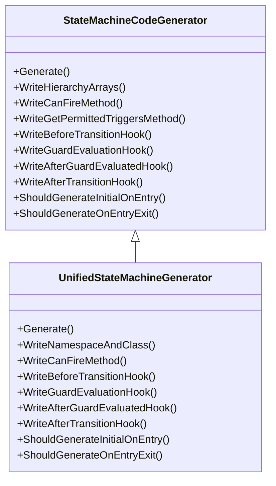

# Generator Architecture

## Overview
This document describes the two main classes responsible for source code generation in the FastFSM project: `StateMachineCodeGenerator` and `UnifiedStateMachineGenerator`. It reflects the current implementation in the `Generator/SourceGenerators` project.

## StateMachineCodeGenerator
`StateMachineCodeGenerator` is an abstract base class that provides common services for all state machine code generators. It manages the `StateMachineModel`, prepares the `StringBuilder`, and exposes a set of virtual hooks used to customize the emitted source code.

Key responsibilities include:
- Writing namespace and class scaffolding.
- Emitting hierarchy support structures and methods.
- Generating runtime helpers such as guard evaluation and transition hooks.
- Providing overridable methods like `WriteCanFireMethod` and `WriteGetPermittedTriggersMethod` that can be tailored by subclasses.

## UnifiedStateMachineGenerator
`UnifiedStateMachineGenerator` derives from `StateMachineCodeGenerator` and consolidates all generator variants into a single implementation controlled by feature flags.

### Overrides
The class overrides the following members from the base class:

- `Generate()`
- `WriteNamespaceAndClass()`
- `WriteCanFireMethod(...)`
- `WriteBeforeTransitionHook(...)`
- `WriteGuardEvaluationHook(...)`
- `WriteAfterGuardEvaluatedHook(...)`
- `WriteAfterTransitionHook(...)`
- `ShouldGenerateInitialOnEntry()`
- `ShouldGenerateOnEntryExit()`

### Delegations to Base Methods
`UnifiedStateMachineGenerator` still leverages several non-virtual helpers from its base:

| Location | Base Method | Purpose |
|----------|-------------|---------|
| `WriteTransitionLogicSyncCore` | `WriteTransitionLogicForFlatNonPayload` | Reuses core transition logic for non-extension variants. |
| `WriteTryFireStructureDispatcher` | `WriteTryFireStructure` | Uses the base implementation when extensions are disabled. |

### UML Diagram

