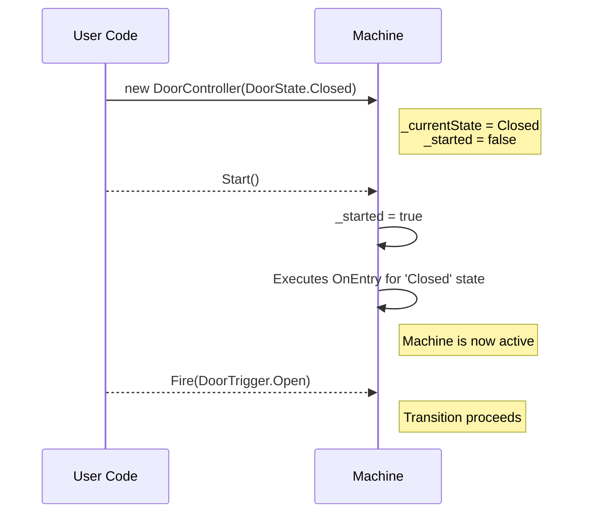

# FastFSM - High-Performance State Machines for .NET

FastFSM is a powerful, zero-overhead finite state machine framework for .NET that leverages C# source generators to create highly optimized state machines at compile time. It combines the ease of declarative configuration with performance that rivals hand-written code.

**🎉 Version 0.7 Complete (August 17, 2024)** - Full Hierarchical State Machine (HSM) support is now available! Create parent-child state relationships, use history modes, set transition priorities, and leverage internal transitions - all while maintaining our zero-allocation, sub-nanosecond performance guarantees.

## Table of Contents

  - [Why FastFSM?](#why-fastfsm)
  - [Key Features](#key-features)
  - [Getting Started](#getting-started)
  - [Core Concepts](#core-concepts)
  - [New in 0.7: Hierarchical State Machines (HSM)](#new-in-07-hierarchical-state-machines-hsm)
  - [The State Machine Lifecycle (New in 0.6)](#the-state-machine-lifecycle-new-in-06)
  - [Basic Usage](#basic-usage)
  - [API Reference](#api-reference)
  - [Advanced Features](#advanced-features)
  - [Performance](#performance)
  - [Real-World Examples](#real-world-examples)
  - [Architecture Overview](#architecture-overview)
  - [Migration Guide](#migration-guide)
  - [Contributing](#contributing)
  - [License](#license)

## Why FastFSM?

Traditional .NET state machine libraries often rely on reflection, dictionaries, or expression trees at runtime, leading to:

  - Performance overhead from indirect calls and allocations
  - Runtime errors that could be caught at compile time
  - Poor compatibility with AOT compilation and trimming
  - Complex APIs that obscure the actual state logic

FastFSM solves these problems by generating optimized code at compile time, giving you:

  - **Zero runtime reflection** - all transitions compile to simple switch statements
  - **Zero heap allocations** - no garbage collection pressure in your state logic
  - **Compile-time validation** - invalid states and transitions are caught during build
  - **Predictable Lifecycle** - explicit start-up logic eliminates race conditions
  - **Native AOT ready** - fully compatible with trimming and ahead-of-time compilation
  - **Intuitive API** - define states with simple attributes, no complex fluent builders

-----

## Key Features

  - 🚀 **Blazing Fast** - flat transitions execute in ~0.8 nanoseconds, HSM in ~12 nanoseconds
  - 🗑️ **Zero Allocations** - no heap allocations during state transitions
  - 🛡️ **Type Safe** - full IntelliSense support and compile-time checking
  - 📦 **Modular Design** - pay only for features you use
  - 🔌 **Extensible** - optional logging, dependency injection, and custom extensions
  - ⚡ **Async Support** - first-class async/await support with separate sync/async APIs
  - 🎯 **AOT Compatible** - works with Native AOT and aggressive trimming
  - 🏗️ **Hierarchical States** (v0.7) - parent-child relationships with automatic initial substates
  - 📚 **History Support** (v0.7) - shallow and deep history modes for state restoration
  - 🎚️ **Transition Priorities** (v0.7) - explicit control over transition resolution order
  - ⚡ **Internal Transitions** (v0.7) - execute actions without state change or exit/entry callbacks

-----

## Getting Started

### Installation

```bash
# Core package - just the essentials
dotnet add package FastFSM.Net

# Optional: Add structured logging support
dotnet add package FastFSM.Net.Logging

# Optional: Add dependency injection integration
dotnet add package FastFSM.Net.DependencyInjection
```

### Quick Example

```csharp
// 1. Define your states and triggers as enums
public enum DoorState { Open, Closed, Locked }
public enum DoorTrigger { Open, Close, Lock, Unlock }

// 2. Create your state machine class
[StateMachine(typeof(DoorState), typeof(DoorTrigger))]
public partial class DoorController
{
    // 3. Define transitions using attributes
    [Transition(DoorState.Closed, DoorTrigger.Open, DoorState.Open)]
    [Transition(DoorState.Open, DoorTrigger.Close, DoorState.Closed)]
    [Transition(DoorState.Closed, DoorTrigger.Lock, DoorState.Locked)]
    [Transition(DoorState.Locked, DoorTrigger.Unlock, DoorState.Closed)]
    private void ConfigureTransitions() { }
}

// 4. Use your state machine
var door = new DoorController(DoorState.Closed);
door.Start(); // Start the machine to trigger initial OnEntry callbacks

door.CanFire(DoorTrigger.Open);  // true
door.Fire(DoorTrigger.Open);       // door is now Open
door.CurrentState;                 // DoorState.Open
```

### Quick Example - Hierarchical States (v0.7)

```csharp
// Define states with parent-child relationships
public enum WorkflowState 
{ 
    Idle,
    Processing,           // Parent state
    Processing_Loading,   // Child of Processing
    Processing_Working,   // Child of Processing
    Processing_Saving,    // Child of Processing
    Complete
}

// Create hierarchical state machine
[StateMachine(typeof(WorkflowState), typeof(WorkflowTrigger), EnableHierarchy = true)]
public partial class WorkflowMachine
{
    // Define parent state with history
    [State(WorkflowState.Processing, History = HistoryMode.Shallow)]
    private void ConfigureProcessing() { }
    
    // Define initial child state
    [State(WorkflowState.Processing_Loading, Parent = WorkflowState.Processing, IsInitial = true)]
    private void ConfigureLoading() { }
    
    // Transitions work across hierarchy
    [Transition(WorkflowState.Idle, WorkflowTrigger.Start, WorkflowState.Processing)]
    // Automatically enters Processing_Loading as initial child
    
    // Internal transition - executes action without state change
    [InternalTransition(WorkflowState.Processing, WorkflowTrigger.UpdateProgress, 
        Action = nameof(LogProgress))]
    private void ConfigureTransitions() { }
}
```

-----

## Core Concepts

### States and Triggers

States represent the possible conditions of your system, while triggers are the events that cause transitions between states. Both are defined as enums for type safety and performance.

### Transitions

Transitions define how your state machine moves from one state to another in response to triggers. They can include:

  - **Guards** - conditions that must be true for the transition to occur
  - **Actions** - code that executes during the transition

### State Callbacks

States can have entry and exit callbacks that execute when entering or leaving a state:

  - **OnEntry** - executes when entering a state
  - **OnExit** - executes when leaving a state

-----

## Hierarchical State Machines (HSM) - New in v0.7

FastFSM 0.7 introduces **Hierarchical State Machines**, enabling you to organize states into parent-child relationships for more maintainable and scalable designs. HSM adds powerful features while maintaining FastFSM's zero-allocation, sub-nanosecond performance guarantees.

### Core HSM Concepts

#### State Hierarchy
States can now have parent-child relationships, where entering a parent state automatically transitions to its designated initial child state:

```csharp
[State(MenuState.Menu_Main, Parent = MenuState.Menu, IsInitial = true)]
[State(MenuState.Menu_Settings, Parent = MenuState.Menu)]
```

#### History Modes
Parent states can remember their last active child state:
- **Shallow History** - remembers only the direct child
- **Deep History** - remembers the entire substate path

```csharp
[State(MenuState.Menu, History = HistoryMode.Shallow)]
```

#### Internal Transitions
Execute actions without changing state or triggering exit/entry callbacks:

```csharp
[InternalTransition(MenuState.Menu, MenuTrigger.RefreshUI, Action = nameof(RefreshDisplay))]
```

#### Transition Priorities
Control which transitions take precedence when multiple could handle the same trigger:

```csharp
[Transition(State.Child, Trigger.Next, State.Other, Priority = 100)]  // Higher priority
[Transition(State.Parent, Trigger.Next, State.Fallback, Priority = 50)] // Lower priority
```

### Enabling HSM

HSM is automatically enabled when you use any hierarchical features. You can also explicitly enable it:

```csharp
[StateMachine(typeof(State), typeof(Trigger), EnableHierarchy = true)]
```

### Transition Resolution Order

When multiple transitions could handle the same trigger, FastFSM resolves them deterministically:

1. **Higher Priority wins** - Transitions with higher `Priority` values execute first
2. **Child beats Parent** - Child state transitions override parent transitions at same priority
3. **Declaration order** - First declared wins when priorities are equal

### Performance Characteristics

HSM maintains FastFSM's commitment to zero allocations:

- **Basic HSM transitions**: 11.69 ns (parent→child with entry/exit chains)
- **Internal transitions**: 4.24 ns (fastest - no state change)
- **Shallow history restore**: 15.01 ns  
- **Async with yield**: 409.90 ns (async state machine overhead - 376 B for state machine)
- **All synchronous operations**: **0 bytes allocated**

Compared to Stateless HSM implementation:
- **47× faster** for basic hierarchical transitions (11.69 ns vs 548.91 ns)
- **61× faster** for internal transitions (4.24 ns vs 259.03 ns)
- **2.8× faster** for async operations (409.90 ns vs 1,164.60 ns)
- **Zero allocations** vs 1.4-3.9 KB per operation in Stateless

For state machines with ≤64 states, hierarchy checks use optimized bitmask operations. Larger state spaces automatically switch to array-based masks.

### Complete HSM Example

```csharp
public enum ProcessState 
{ 
    Idle,
    Work,           // Parent state
    Work_Loading,   // Child of Work  
    Work_Active,    // Child of Work
    Work_Paused,    // Child of Work
    Complete,
    Error
}

[StateMachine(typeof(ProcessState), typeof(ProcessTrigger))]
public partial class ProcessWorkflow
{
    private int _progress = 0;
    
    // Parent state with shallow history
    [State(ProcessState.Work, 
        History = HistoryMode.Shallow,
        OnEntry = nameof(InitializeWork),
        OnExit = nameof(CleanupWork))]
    private void ConfigureWork() { }
    
    // Initial child state
    [State(ProcessState.Work_Loading, 
        Parent = ProcessState.Work, 
        IsInitial = true)]
    
    // Other child states
    [State(ProcessState.Work_Active, Parent = ProcessState.Work)]
    [State(ProcessState.Work_Paused, Parent = ProcessState.Work)]
    private void ConfigureWorkStates() { }
    
    // Transition to parent automatically enters initial child
    [Transition(ProcessState.Idle, ProcessTrigger.Start, ProcessState.Work)]
    
    // Internal transition - updates without state change
    [InternalTransition(ProcessState.Work_Active, ProcessTrigger.Tick, 
        Guard = nameof(CanUpdate),
        Action = nameof(UpdateProgress))]
    
    // High priority transition from child
    [Transition(ProcessState.Work_Active, ProcessTrigger.Complete, ProcessState.Complete,
        Priority = 100,
        Guard = nameof(IsComplete))]
    
    // Lower priority fallback from parent
    [Transition(ProcessState.Work, ProcessTrigger.Abort, ProcessState.Error)]
    private void ConfigureTransitions() { }
    
    private bool CanUpdate() => _progress < 100;
    private bool IsComplete() => _progress >= 100;
    private void UpdateProgress() => _progress += 10;
}

// Usage
var workflow = new ProcessWorkflow(ProcessState.Idle);
workflow.Start();

workflow.Fire(ProcessTrigger.Start);     // Idle → Work → Work_Loading (initial)
workflow.Fire(ProcessTrigger.Continue);  // Work_Loading → Work_Active
workflow.Fire(ProcessTrigger.Tick);      // Internal transition, stays in Work_Active
workflow.Fire(ProcessTrigger.Pause);     // Work_Active → Work_Paused
workflow.Fire(ProcessTrigger.Abort);     // Exits entire hierarchy → Error
```

### Hierarchy Debugging

In DEBUG builds, FastFSM provides helpers for understanding the current state hierarchy:

```csharp
#if DEBUG
var workflow = new ProcessWorkflow(ProcessState.Work_Active);
workflow.Start();
Console.WriteLine(workflow.DumpActivePath());
// Output: "Work / Work_Active"
#endif
```

### Migration Notes

Flat state machines from v0.6 continue to work without any changes. HSM features are opt-in and only activate when you use hierarchical attributes (`Parent`, `IsInitial`, `History`).

-----

## The State Machine Lifecycle (New in 0.6)

As of version 0.6, creating a state machine and running it are two distinct steps. The constructor **only** sets the initial state. You must explicitly start the machine to make it operational and trigger the first `OnEntry` callback. This change prevents race conditions and makes the machine's behavior deterministic.

1.  **Constructor**: Sets the initial `CurrentState` but does **not** run any `OnEntry` logic. The machine is not yet active.
2.  **`Start()` / `StartAsync()`**: Activates the machine. This method runs the `OnEntry` callback for the initial state. Subsequent calls to `Start()` do nothing.
3.  **Operations**: Calling any method like `Fire`, `TryFire`, or `CanFire` before `Start()` will throw an `InvalidOperationException`.



-----

## Basic Usage

### Simple State Machine

```csharp
[StateMachine(typeof(OrderState), typeof(OrderTrigger))]
public partial class OrderWorkflow
{
    [Transition(OrderState.New, OrderTrigger.Submit, OrderState.Submitted)]
    [Transition(OrderState.Submitted, OrderTrigger.Approve, OrderState.Approved)]
    [Transition(OrderState.Submitted, OrderTrigger.Reject, OrderState.Rejected)]
    private void Configure() { }
}

// Usage
var workflow = new OrderWorkflow(OrderState.New);
workflow.Start();
workflow.Fire(OrderTrigger.Submit);
```

### Adding Guards and Actions

```csharp
[StateMachine(typeof(AccountState), typeof(AccountTrigger))]
public partial class BankAccount
{
    private decimal _balance;
    
    [Transition(AccountState.Active, AccountTrigger.Withdraw, AccountState.Active,
        Guard = nameof(HasSufficientFunds),
        Action = nameof(DebitAccount))]
    private void ConfigureWithdrawal() { }
    
    private bool HasSufficientFunds() => _balance >= 100;
    private void DebitAccount() => _balance -= 100;
}

// Usage
var account = new BankAccount(AccountState.Active);
account.Start();
account.Fire(AccountTrigger.Withdraw);
```

### State Entry/Exit Callbacks

```csharp
[StateMachine(typeof(ConnectionState), typeof(ConnectionTrigger))]
public partial class NetworkConnection
{
    [State(ConnectionState.Connected, 
        OnEntry = nameof(StartHeartbeat),
        OnExit = nameof(StopHeartbeat))]
    private void ConfigureStates() { }
    
    [Transition(ConnectionState.Disconnected, ConnectionTrigger.Connect, ConnectionState.Connected)]
    [Transition(ConnectionState.Connected, ConnectionTrigger.Disconnect, ConnectionState.Disconnected)]
    private void ConfigureTransitions() { }
    
    private void StartHeartbeat() => Console.WriteLine("Heartbeat started");
    private void StopHeartbeat() => Console.WriteLine("Heartbeat stopped");
}

// Usage
var connection = new NetworkConnection(ConnectionState.Disconnected);
connection.Start(); // Machine is not active until started
connection.Fire(ConnectionTrigger.Connect); // "Heartbeat started" is printed
```

-----

## API Reference

### StateMachine Attribute

Marks a partial class as a state machine.

```csharp
[StateMachine(typeof(TState), typeof(TTrigger))]
```

**Parameters:**

  - `TState` - Enum type defining possible states
  - `TTrigger` - Enum type defining possible triggers

**Optional Properties:**

  - `DefaultPayloadType` - Default payload type for all transitions
  - `GenerateExtensibleVersion` - Enable extension support
  - `EnableHierarchy` - Enable hierarchical state machine features (v0.7)

### Transition Attribute

Defines a state transition.

```csharp
[Transition(fromState, trigger, toState, Guard = "method", Action = "method", Priority = 0)]
```

**Parameters:**

  - `fromState` - Source state
  - `trigger` - Trigger that causes transition
  - `toState` - Destination state
  - `Guard` (optional) - Method name that returns bool
  - `Action` (optional) - Method name to execute during transition
  - `Priority` (optional, v0.7) - Transition priority (higher values = higher priority, default: 0)

### InternalTransition Attribute (v0.7)

Defines an internal transition that executes an action without changing state.

```csharp
[InternalTransition(state, trigger, Guard = "method", Action = "method", Priority = 0)]
```

**Parameters:**

  - `state` - State where the internal transition is active
  - `trigger` - Trigger that causes the internal transition
  - `Guard` (optional) - Method name that returns bool
  - `Action` (optional) - Method name to execute
  - `Priority` (optional) - Transition priority for resolution order

### State Attribute

Configures state-specific behavior.

```csharp
[State(state, OnEntry = "method", OnExit = "method", 
       Parent = parentState, IsInitial = false, History = HistoryMode.None)]
```

**Parameters:**

  - `state` - The state to configure
  - `OnEntry` (optional) - Method to execute when entering state
  - `OnExit` (optional) - Method to execute when leaving state
  - `Parent` (optional, v0.7) - Parent state for hierarchical relationships
  - `IsInitial` (optional, v0.7) - Marks state as initial child of parent (default: false)
  - `History` (optional, v0.7) - History mode: None, Shallow, or Deep

### Generated Methods

Every state machine automatically gets these methods. **Note:** All methods (except the constructor) will throw an `InvalidOperationException` if called before `Start()` / `StartAsync()`.

```csharp
// Current state of the machine
TState CurrentState { get; }

// Starts the machine, making it operational and running the initial OnEntry callback.
void Start()
ValueTask StartAsync(CancellationToken ct = default)

// Try to fire a trigger (returns true if successful)
bool TryFire(TTrigger trigger, object? payload = null)
ValueTask<bool> TryFireAsync(TTrigger trigger, object? payload = null, CancellationToken ct = default)

// Fire a trigger (throws if invalid)
void Fire(TTrigger trigger, object? payload = null)
ValueTask FireAsync(TTrigger trigger, object? payload = null, CancellationToken ct = default)

// Check if a trigger can be fired
bool CanFire(TTrigger trigger)

// Get all valid triggers from current state
IReadOnlyList<TTrigger> GetPermittedTriggers()

// HSM-specific methods (v0.7, when hierarchy is enabled):
bool IsInHierarchy(TState ancestor)  // Check if current state is within ancestor's hierarchy

// DEBUG-only (v0.7):
#if DEBUG
string DumpActivePath()  // Returns the active state path (e.g., "Parent / Child")
#endif
```

### Extension Hooks

When extension support is enabled (extensible machines), the following hooks are invoked around a transition in an order consistent with UML run-to-completion semantics:

- Before: `OnBeforeTransition(ctx)` — after a transition path is selected (from, trigger, to), before any effects.
- Guard start: `OnGuardEvaluation(ctx, guardName)` — immediately before the guard is evaluated.
- Guard result: `OnGuardEvaluated(ctx, guardName, result)` — immediately after evaluation.
- Exit: state `OnExit` of the source state (if defined).
- Action: transition action (if defined).
- State change: `CurrentState` is set to the target state.
- Entry: state `OnEntry` of the target state (if defined).
- After: `OnAfterTransition(ctx, success)` — success=true when the whole sequence completes; otherwise success=false.

Notes:
- Guard hooks are only fired during `TryFire`/`Fire` (not during `CanFire` or `GetPermittedTriggers`).
- If a guard returns false: `OnBeforeTransition` → `OnGuardEvaluation` → `OnGuardEvaluated(false)` → `OnAfterTransition(false)`.
- If an exception occurs during Exit/Action/Entry: `OnAfterTransition(false)` is invoked; no additional rollback is guaranteed.

-----

## Advanced Features

### Nested State Machine Classes

State machine types can be declared as nested partial classes inside other types. The generator will mirror the containing class hierarchy so that callbacks and guard/action methods resolve correctly:

```csharp
public class OuterContainer
{
    public enum InnerState { A, B }
    public enum InnerTrigger { Next }

    [StateMachine(typeof(InnerState), typeof(InnerTrigger))]
    public partial class InnerMachine
    {
        [Transition(InnerState.A, InnerTrigger.Next, InnerState.B)]
        private void Configure() { }
        private void OnEntryA() => Console.WriteLine("Entering A");
    }
}

// Usage
var machine = new OuterContainer.InnerMachine(OuterContainer.InnerState.A);
machine.Start(); // Nested callbacks resolve in correct scope
```

### Typed Payloads

```csharp
[StateMachine(typeof(ProcessState), typeof(ProcessTrigger))]
[PayloadType(typeof(ProcessData))]
public partial class DataProcessor
{
    [Transition(ProcessState.Ready, ProcessTrigger.Start, ProcessState.Processing,
        Guard = nameof(IsValidData),
        Action = nameof(ProcessData))]
    private void Configure() { }
    
    private bool IsValidData(ProcessData data) => data != null && data.IsValid;
    private void ProcessData(ProcessData data) => Console.WriteLine($"Processing {data.Id}");
}

// Usage
var processor = new DataProcessor(ProcessState.Ready);
processor.Start(); // Must be started before use
var data = new ProcessData { Id = "123", IsValid = true };
processor.Fire(ProcessTrigger.Start, data);
```

### Async Support

FastFSM provides separate sync and async APIs for clarity and type safety. Async methods return `ValueTask` for high performance.

```csharp
[StateMachine(typeof(DownloadState), typeof(DownloadTrigger))]
public partial class FileDownloader
{
    [Transition(DownloadState.Ready, DownloadTrigger.Start, DownloadState.Downloading,
        Action = nameof(StartDownloadAsync))]
    private void Configure() { }
    
    private async ValueTask StartDownloadAsync()
    {
        await Task.Delay(100); // Simulate async work
    }
}

// Usage
var downloader = new FileDownloader(DownloadState.Ready);
await downloader.StartAsync(); // Use StartAsync for async machines
await downloader.FireAsync(DownloadTrigger.Start);
```

### Dependency Injection

When using `FastFSM.Net.DependencyInjection`, the `IStateMachineFactory` provides helpers to manage the new lifecycle:

```csharp
// In your service configuration (e.g., Program.cs)
services.AddStateMachineFactory();
services.AddTransient<OrderWorkflow>(); // Register your state machine

// In your consumer class
public class OrderService(IStateMachineFactory factory)
{
    public void ProcessNewOrder()
    {
        // Option 1: Create and start manually
        var sm1 = factory.Create<OrderWorkflow>(OrderState.New);
        sm1.Start();
        
        // Option 2: Create and start in one step
        var sm2 = factory.CreateStarted<OrderWorkflow>(OrderState.New);
        
        // Option 3: For async machines
        var downloader = await factory.CreateStartedAsync<FileDownloader>(DownloadState.Ready);
    }
}
```

-----

## Benchmarks

### Performance Summary

FastFSM achieves **sub-nanosecond** transition times for flat state machines and **single-digit nanosecond** times for hierarchical operations, all with **zero heap allocations**. 

- **Flat FSM**: 0.81 ns per transition, 0 bytes allocated
- **HSM Basic**: 11.69 ns per hierarchical transition, 0 bytes allocated  
- **HSM Internal**: 4.24 ns per internal transition, 0 bytes allocated
- **HSM History**: 15.01 ns for shallow history restore, 0 bytes allocated

When compared to state machine libraries across languages, FastFSM demonstrates the value of compile-time code generation over runtime abstractions.

### Test Environment

| Component       | Version / Details                                              |
| --------------- | -------------------------------------------------------------- |
| **CPU**         | AMD Ryzen 5 9600X (6C/12T Zen 5 @ 3.9–5.4 GHz, AVX‑512)        |
| **Memory**      | 32 GB DDR5, Windows 11 24H2 "High Performance" power plan      |
| **.NET**        |  9.0.5 (*RyuJIT AVX‑512*, Server GC, `COMPlus_EnableAVX512=1`) |
| **JVM**         |  OpenJDK 21.0.8+9‑LTS (Temurin, Server VM, G1 GC)              |
| **C++**         |  MSVC 19.44 (/O2 /GL /arch:AVX512) + Google Benchmark 1.8.4   |
| **Rust**        |  rustc 1.80 + Statig 0.4 + criterion 0.5.1 (LTO, `codegen-units=1`) |
| **TypeScript**  |  Bun 1.2.19 + mitata (compiled TS → JS)                        |
| **JavaScript**  |  Bun 1.2.19 + mitata (pure ES2023)                             |
| **Tools**       | BenchmarkDotNet 0.15.2 (.NET), JMH 1.37 (Java)                 |
| **Methodology** | 1024 ops per iteration · 15 iterations (mean ± StdDev)         |
| **Date**        | 7 Aug 2025                                                     |

*Results may vary ± 5‑8 % on CPUs without AVX‑512 support. Rust benchmarks use Statig 0.4 library for library-to-library comparison fairness.*

---

### FastFSM vs .NET State‑Machine Libraries

| Scenario               | FastFSM     | Stateless  | LiquidState  | Appccelerate | Winner                       |
| ---------------------- | ----------- | ---------- | ------------ | ------------ | ---------------------------- |
| **Basic Transitions**  | **0.81 ns** | 249.03 ns  | 25.31 ns     | 260.85 ns    | FastFSM (31× vs LiquidState) |
| Guards + Actions       | **2.18 ns** | 267.37 ns  |  n/a¹        | 273.53 ns    | FastFSM (123× vs Stateless)  |
| Payload                | **0.83 ns** | 300.63 ns  | 30.13 ns     | 291.60 ns    | FastFSM (36× vs LiquidState) |
| Can Fire Check         | **0.31 ns** | 115.54 ns  |  n/a¹        |  n/a¹        | FastFSM (373× vs Stateless)  |
| Get Permitted Triggers | **4.18 ns** | 32.69 ns   |  n/a¹        |  n/a¹        | FastFSM (7.8× vs Stateless)  |
| Async Hot Path²        | 444.77 ns   | 357.12 ns  | **75.87 ns** | 504.37 ns    | LiquidState (5.9× faster)    |
| Async With Yield³      | **456.72 ns**| 1100.78 ns | 490.22 ns    | 1738.62 ns   | FastFSM                      |

¹ API not available   ² `ValueTask.CompletedTask` vs `Task.FromResult`   ³ `Task.Yield()` for real context switch

---

### FastFSM HSM vs Stateless HSM (v0.7)

| Scenario                      | FastFSM HSM  | Stateless HSM | Speedup    | FastFSM Allocations | Stateless Allocations |
| ----------------------------- | -----------: | ------------: | ---------- | ------------------: | --------------------: |
| **Hierarchical Transitions**  | **11.69 ns** | 548.91 ns     | **47×**    | **0 B**            | 3,952 B              |
| Internal Transitions          | **4.24 ns**  | 259.03 ns     | **61×**    | **0 B**            | 1,408 B              |
| Shallow History Restore       | **15.01 ns** | n/a           | n/a        | **0 B**            | n/a                  |
| Async With Yield             | **409.90 ns**| 1,164.60 ns   | **2.8×**   | 376 B¹             | 13,434 B             |

¹ .NET async/await framework overhead when yielding - FastFSM code itself is allocation-free
² .NET async/await framework overhead when using Task.Yield() - FastFSM code itself is allocation-free

**Key Insights:**
- FastFSM HSM maintains zero allocations for all synchronous operations
- Hierarchical transitions are nearly as fast as flat FSM transitions (11.69 ns vs 0.81 ns)
- Internal transitions are the fastest HSM operation at 4.24 ns
- Even async operations are 2.8× faster with 36× fewer allocations

---

### FastFSM vs TypeScript (Bun)

| Scenario                  | TypeScript (Bun) | FastFSM (.NET) | Δ (relative)   |
| ------------------------- | ---------------- | -------------- | -------------- |
| **Basic Transitions**     | ~1.2 ns         | **0.81 ns**    | 1.5× slower    |
| Guards + Actions          | **~1.5 ns**     | 2.18 ns        | 1.45× *faster* |
| Payload                   | ~2.8 ns         | **0.83 ns**    | 3.4× slower    |
| Can Fire Check            | ~0.6 ns         | **0.31 ns**    | 2.0× slower    |
| Get Permitted Triggers    | **~1.0 ns**     | 4.18 ns        | 4.2× *faster*  |
| Async Hot Path (no yield) | **~208 ns**     | 444.77 ns      | 2.1× *faster*  |
| Async With Yield          | ~2000 ns        | **456.72 ns**  | 4.4× slower    |

*TS implementation: minimal FSM with `switch`; Bun's JIT optimises hot paths strongly. Async models differ (`setImmediate()` vs `Task.Yield()`).*

---

### FastFSM vs JavaScript (Bun)

| Scenario               | JavaScript (Bun) | FastFSM (.NET) | Δ (relative)   |
| ---------------------- | ---------------- | -------------- | -------------- |
| **Basic Transitions**  | ~1.0 ns         | **0.81 ns**    | 1.2× slower    |
| Guards + Actions       | ~3.0 ns         | **2.18 ns**    | 1.4× slower    |
| Payload                | ~2.8 ns         | **0.83 ns**    | 3.4× slower    |
| Can Fire Check         | ~0.38 ns        | **0.31 ns**    | 1.2× slower    |
| Get Permitted Triggers | **~0.39 ns**    | 4.18 ns        | 10.7× *faster* |
| Async Hot Path         | **~203 ns**     | 444.77 ns      | 2.2× *faster*  |
| Async With Yield       | ~712 ns         | **456.72 ns**  | 1.6× slower    |

*Pure ES2023 class with `switch`, same methodology.*

---

### FastFSM vs Java State‑Machine Libraries

| Scenario              | FastFSM (.NET)    | Squirrel (JDK 21) | Spring StateMachine (JDK 21) |
| --------------------- | ----------------- | ----------------- | ---------------------------- |
| **Basic Transitions** | **0.81 ns / 0 B** | 289 ns / 1.5 kB   | 12 188 ns / 30.7 kB          |
| Guards + Actions      | **2.18 ns / 0 B** | 321 ns / 1.5 kB   | 13 564 ns / 31.3 kB          |
| Payload               | **0.83 ns / 0 B** | 311 ns / 1.5 kB   | 12 321 ns / 31.6 kB          |
| Async Hot Path        | 444.77 ns         | **314 ns**        | 12 110 ns                    |
| Async With Yield      | **456.72 ns**     | 310 ns            | 26 599 ns                    |

---

### FastFSM vs C++ State Machines (Boost.SML)

| Scenario              | FastFSM (.NET) | Boost.SML (C++) | Δ                   |
| --------------------- | -------------- | --------------- | ------------------- |
| **Basic Transitions** | **0.81 ns**    | 1.23 ns         | FastFSM 1.5× faster |
| Guards + Actions      | 2.18 ns        | **1.32 ns**     | C++ 1.7× faster     |
| Payload               | **0.83 ns**    | 1.35 ns         | FastFSM 1.6× faster |
| Can Fire Check        | **0.31 ns**    | 1.28 ns         | 4.1× faster         |
| Async Hot Path*      | 444.77 ns      | 1.38 ns         | *Not comparable*    |

*Boost.SML "async" is a synchronous simulation (no coroutines).*

---

### FastFSM vs Rust State Machines (Statig Library)

| Scenario              | FastFSM (.NET) | Rust (Statig 0.4) | Δ                      |
| --------------------- | -------------- | ----------------- | ---------------------- |
| **Basic Transitions** | **0.81 ns**    | 1,730 ns          | FastFSM 2,136× faster  |
| Guards + Actions      | 2.18 ns        | **0.37 ns**       | Statig 5.9× faster     |
| Payload               | 0.83 ns        | **0.41 ns**       | Statig 2.0× faster     |
| Async Hot Path        | 444.77 ns      | **7.3 ns**        | Statig 61× faster      |
| Async With Yield      | 456.72 ns      | **19.4 ns**       | Statig 24× faster      |

**Note**: Rust benchmarks use the Statig 0.4 library for fair library-to-library comparison. Statig's abstractions add significant overhead for basic transitions (enum wrapping, trait dispatch) but excel at complex scenarios through aggressive inlining. Hand-rolled Rust code would show different trade-offs: ~1.77 ns for basic transitions but 0.7–0.8 ns for guards/payload scenarios.

---

### Cross‑Language Summary (ns/op)

| Scenario           | FastFSM (.NET) | Java | C++  | Rust (Statig) | TypeScript (Bun) | JavaScript (Bun) | Fastest        |
| ------------------ | -------------- | ---- | ---- | ------------- | ---------------- | ---------------- | -------------- |
| **Basic**          | **0.81**       | 289  | 1.23 | 1,730         | 1.2              | 1.0              | **FastFSM**    |
| **Guards+Actions** | 2.18           | 321  | 1.32 | **0.37**      | 1.5              | 3.0              | **Rust**       |
| **Payload**        | 0.83           | 311  | 1.35 | **0.41**      | 2.8              | 2.8              | **Rust**       |
| **Async (hot)**    | 444.77         | 314  | 1.38 | **7.3**       | 208              | 203              | **C++***       |
| **Async (yield)**  | 456.72         | 310  | n/a  | **19.4**      | 2000             | 712              | **Rust**       |

*C++ "async" is synchronous simulation only; Rust shows true async performance.

---

### Memory Allocations per Operation

| Library                      | Allocations / op     | Native Code Size |
| ---------------------------- | -------------------- | ---------------- |
| FastFSM (Flat)              | **0 bytes**          | 160 – 8,050 B    |
| FastFSM HSM (Sync)          | **0 bytes**          | 2,242 – 3,626 B  |
| FastFSM HSM (Async)         | 376 bytes¹           | 6,348 B          |
| Statig (Rust)               | **0 bytes**          | ~2 – 8 KB        |
| Stateless (Flat)            | 608 – 2,295 B        | 3,436 – 21,417 B |
| Stateless HSM               | 1,408 – 3,952 B      | 11,643 – 15,069 B|
| LiquidState                 | 136 – 656 B          | 64 – 3,496 B     |
| Appccelerate                | 1,608 – 3,166 B      | 1,084 – 3,721 B  |
| Squirrel                    | 1,456 – 1,536 B      | n/a              |
| Spring StateMachine         | 30,675 – 31,659 B    | n/a              |
| TypeScript (Bun)            | ~40 – 90 B (engine)  | n/a              |
| JavaScript (Bun)            | ~40 – 60 B (engine)  | n/a              |

¹ Async state machine overhead (unavoidable in .NET async/await)

---

### Key Performance Insights

The benchmarks reveal fundamental trade-offs in state machine design:

1. **Library Abstractions vs Hand-rolled Code**: The Rust Statig library shows a 1000× slowdown for basic transitions compared to hand-rolled code (1,730 ns vs 1.77 ns), demonstrating the cost of runtime abstractions. However, it excels at complex scenarios through aggressive inlining.

2. **Compile-time vs Runtime**: FastFSM's source generator approach achieves hand-rolled performance while maintaining library convenience. This validates the design choice of compile-time code generation over runtime flexibility.

3. **Hierarchical Performance**: FastFSM HSM adds only ~10 ns overhead for hierarchical transitions (11.69 ns vs 0.81 ns flat), while competitors like Stateless require 500+ ns. Internal transitions at 4.24 ns are even faster than some flat FSM operations.

4. **Language vs Implementation**: Performance varies more by implementation strategy than language choice. A well-optimized library in any language can outperform poorly designed code in a "faster" language.

5. **Zero-allocation Achievement**: Both FastFSM and Statig achieve true zero-allocation operation, critical for high-frequency state transitions in performance-sensitive applications. FastFSM extends this to hierarchical state machines, maintaining 0 B allocations for all synchronous HSM operations.

---


## Real-World Examples

All examples assume the machine is started with `Start()` or `StartAsync()` after instantiation.

### Order Processing System

```csharp
[StateMachine(typeof(OrderState), typeof(OrderTrigger))]
[PayloadType(typeof(Order))]
public partial class OrderProcessor
{
    private readonly IPaymentGateway _paymentGateway;
    private readonly IInventoryService _inventory;
    
    public OrderProcessor(OrderState initial, IPaymentGateway payment, IInventoryService inventory) 
        : this(initial)
    {
        _paymentGateway = payment;
        _inventory = inventory;
    }
    
    [State(OrderState.Processing, OnEntry = nameof(ReserveInventory))]
    [State(OrderState.Cancelled, OnEntry = nameof(ReleaseInventory))]
    private void ConfigureStates() { }
    
    [Transition(OrderState.New, OrderTrigger.Submit, OrderState.Submitted,
        Guard = nameof(IsValid))]
    [Transition(OrderState.Submitted, OrderTrigger.Process, OrderState.Processing,
        Guard = nameof(CanProcess), Action = nameof(ChargePayment))]
    [Transition(OrderState.Processing, OrderTrigger.Ship, OrderState.Shipped)]
    [Transition(OrderState.Submitted, OrderTrigger.Cancel, OrderState.Cancelled)]
    private void ConfigureTransitions() { }
    
    private bool IsValid(Order order) => order.Items.Any() && order.Total > 0;
    private bool CanProcess(Order order) => _inventory.IsAvailable(order.Items);
    private async ValueTask ChargePayment(Order order) => await _paymentGateway.Charge(order);
    private void ReserveInventory(Order order) => _inventory.Reserve(order.Items);
    private void ReleaseInventory(Order order) => _inventory.Release(order.Items);
}
```

-----

## Architecture Overview

FastFSM uses a multi-stage, feature-gated compilation approach:

1.  **Declaration** - You define states and transitions using attributes
2.  **Analysis** - Source generator analyzes your declarations at compile time
3.  **Generation** - Optimized implementation is generated as part of your class
4.  **Compilation** - Everything compiles to efficient IL code

### Feature-Gated Generation (v0.7+)

The generator automatically detects which features you use and emits only the necessary code:

- **Core FSM** - Basic state transitions with guards and actions
- **Payload Support** - Typed payloads with compile-time validation when `[PayloadType]` is used
- **Extensions** - Hook points for logging/monitoring when `GenerateExtensibleVersion = true`
- **Async Support** - ValueTask-based async operations when async methods are detected
- **Hierarchical States** - Parent-child relationships when HSM attributes are used
- **History Tracking** - State history when `History` property is set
- **Internal Transitions** - When `[InternalTransition]` attributes are present

This approach ensures minimal code size and maximum performance - you only pay for what you use.

### Code Generation Strategy

The generator produces different code patterns based on your usage:

#### Flat FSM (default)
```csharp
switch (CurrentState) 
{ 
    switch (trigger) { ... } 
}
```

#### Hierarchical FSM (with HSM features)
```csharp
switch (CurrentState)
{
    case Child:
        // Handle child-specific transitions
        // Fall through to parent with goto
        goto case Parent;
    case Parent:
        // Handle parent transitions
        break;
}
```

#### Performance Optimizations

- **Switch statements** instead of dictionaries or delegates
- **Compile-time flattening** of hierarchies
- **Inline guards** evaluated directly in switch cases
- **Zero virtual calls** - everything is concrete
- **Stack-allocated** history tracking structures

-----

## Migration Guide

### Upgrading to v0.7 (HSM Support)

Version 0.7 adds Hierarchical State Machine support while maintaining **100% backward compatibility**. All existing v0.6 state machines work without any changes.

**What's New:**
- Hierarchical states with parent-child relationships
- History modes (Shallow/Deep) for state restoration
- Internal transitions that don't change state
- Transition priorities for explicit control
- Zero-allocation hierarchy operations

**To Use HSM Features:**
1. Add `Parent` property to child states
2. Mark one child per parent with `IsInitial = true`
3. Optionally add `History` to parent states
4. Use `[InternalTransition]` for stateless actions
5. Set `Priority` on transitions when needed

### Upgrading from v0.5 to v0.6 (Lifecycle Changes)

Version 0.6 introduced the explicit lifecycle model to prevent race conditions.

**Key Changes:**
1. **Must call `Start()`** - State machines must be explicitly started after creation
2. **Updated interfaces** - Use `IStateMachineSync<,>` or `IStateMachineAsync<,>`
3. **Factory changes** - Use `CreateStarted<T>()` for pre-started machines

```csharp
// v0.5 (old)
var machine = new MyMachine(State.Initial);
machine.Fire(Trigger.Start); // Could race with OnEntry

// v0.6+ (current)
var machine = new MyMachine(State.Initial);
machine.Start(); // Explicit start, OnEntry completes before returning
machine.Fire(Trigger.Start);
```

### From Stateless to FastFSM

```csharp
// Stateless
var machine = new StateMachine<State, Trigger>(State.Initial);
machine.Configure(State.Initial)
    .Permit(Trigger.Start, State.Running)
    .SubstateOf(State.Parent);  // Complex hierarchy setup

// FastFSM
[StateMachine(typeof(State), typeof(Trigger))]
public partial class MyMachine
{
    [State(State.Running, Parent = State.Parent, IsInitial = true)]
    [Transition(State.Initial, Trigger.Start, State.Running)]
    private void Configure() { }
}

var machine = new MyMachine(State.Initial);
machine.Start();
machine.Fire(Trigger.Start);
```

### Version History

- **v0.7** (August 2024) - Hierarchical State Machines with zero allocations
- **v0.6** (June 2024) - Explicit lifecycle with `Start()` method
- **v0.5** (April 2024) - Initial public release

-----

## Roadmap

### v0.7.5 (Planned)
- **String-based State/Trigger Support** - Support for `record struct`, `SmartEnum`, and string constants as states/triggers
- Zero-allocation string→ID mapping at compile-time
- Native JSON serialization support for microservices
- Maintains sub-nanosecond performance via internal numeric representation

### v0.8 (Planned)
- Support for >256 states
- Optional initial substates (`RequireExplicitSubstate`)
- Orthogonal regions for parallel state machines
- Completion transitions

### v0.9 (Planned)
- **Deferred Events** (UML 2.5.1 compliant) - Queue events for later processing
- Zero-allocation circular buffer implementation
- Configurable overflow policies (DropOldest/DropNewest)
- Full HSM integration with hierarchical deferral rules
- Visual debugger and state diagram generation
- Mermaid/PlantUML export
- Runtime state machine modification

### v1.0 (Planned)
- Stable API guarantee
- Performance guarantees
- Enterprise support
- JSON serialization for state persistence
- Complete event deferral with value type support

## Contributing

We welcome contributions! Please see [CONTRIBUTING.md](CONTRIBUTING.md) for guidelines.

## License

FastFSM is licensed under the MIT License. See [LICENSE](LICENSE) for details.